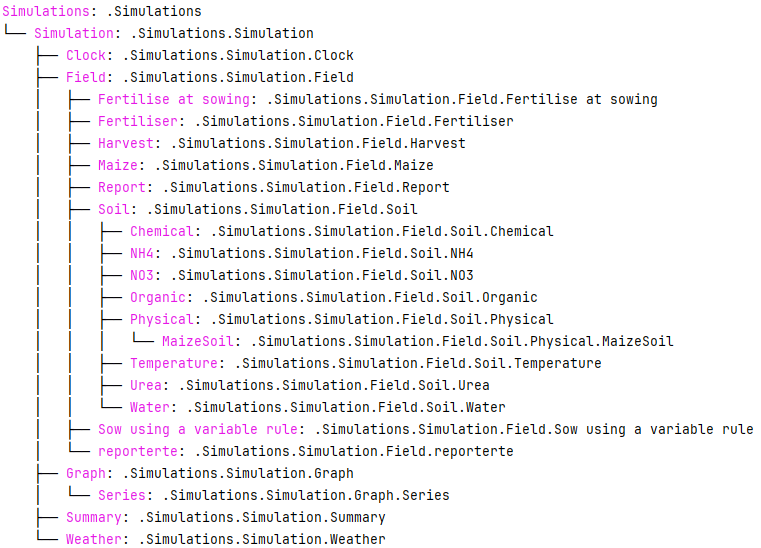

=========
apsimNGpy
=========

.. image:: https://img.shields.io/badge/License-Apache_2.0-blue.svg
   :target: https://opensource.org/licenses/Apache-2.0
   :alt: License: Apache-2.0

.. image:: https://img.shields.io/badge/docs-online-blue.svg
   :target: https://magala-richard.github.io/apsimNGpy-documentations/index.html
   :alt: Documentation

.. image:: https://img.shields.io/pypi/v/apsimNGpy?logo=pypi
   :target: https://pypi.org/project/apsimNGpy/
   :alt: PyPI version

.. image:: https://static.pepy.tech/badge/apsimNGpy
   :target: https://pepy.tech/project/apsimNGpy
   :alt: Total PyPI downloads 

.. image:: https://img.shields.io/pypi/dm/apsimNGpy?logo=pypi
   :target: https://pypi.org/project/apsimNGpy/
   :alt: PyPI downloads

.. image:: https://img.shields.io/github/stars/MAGALA-RICHARD/apsimNGpy?style=social
   :target: https://github.com/MAGALA-RICHARD/apsimNGpy/stargazers
   :alt: GitHub Stars

.. image:: https://img.shields.io/github/forks/MAGALA-RICHARD/apsimNGpy?style=social
   :target: https://github.com/MAGALA-RICHARD/apsimNGpy/network/members
   :alt: GitHub Forks

apsimNGpy: The Next Generation Agroecosytem Simulation Library
====================================================================
Our cutting-edge open-source framework, **apsimNGpy**, empowers advanced agroecosystem modeling through the utilization
of object-oriented principles directly within the `Python`_ environment. It features fast batch file simulation, model prediction, evaluation,
APSIMX file editing, seamless weather data retrieval, optimization, and efficient soil profile development.

.. _Python: https://www.python.org/

Requirements
***********************************************************************************
1. Dotnet, install from https://learn.microsoft.com/en-us/dotnet/core/install/
2. Python 3.10 +
3. APSIM: Add the directory containing the models executable to the system's PATH or python path (to locate the required .dll files). This can be achieved in either of the following ways:
4. Utilize the APSIM installer provided for this purpose.
5. Build APSIM from its source code. This is comming soon
6. Minimum; 8GM RAM, CPU Core i7

.. _Installation:

Installation

********************************************************************************

All versions are currently in development, phase and they can be installed as follows:

- Method 1. install from PyPI

.. code:: bash

    pip install apsimNGpy

- Method 1. clone the current development repository

.. code:: bash

    git clone https://github.com/MAGALA-RICHARD/apsimNGpy.git
    cd apsimNGpy
    pip install .

- Method 2. Use pip straight away and install from github

.. code:: bash

     pip install git+https://github.com/MAGALA-RICHARD/apsimNGpy.git

Full documentation can be found here; https://magala-richard.github.io/apsimNGpy-documentations/index.html

GETTING STARTED
*****************************

Before using apsimNGpy, it is necessary to install APSIM. Please follow the instructions provided at the following link to complete the installation: https://www.apsim.info/download-apsim/downloads/
for MAcOS or Linux users see: https://apsimnextgeneration.netlify.app/install/
model documentation and tutorial are also available via; https://docs.apsim.info/
we expect that by accepting to use apsimNGpy, you have a basic understanding of APSIM process-based model, therefore, our focus is to make sure you are able to use apsimNGpy.

In addition, make sure that the APSIM installation binaries folder is added to the system path.
if you run the following code and returns None you need to do something as explained below.

- 1. Use command line interface

.. code-block:: bash

     apsim_bin_path -s

- 2. Use apsimNGpy config module

.. code-block:: python

   from apsimNGpy.core import config
   print(config.get_apsim_bin_path())

You can also try to check if automatic search will be successful as follows

.. code-block:: bash

    apsim_bin_path --auto_search

The short cut

.. code-block:: bash

    apsim_bin_path -a

Locating the APSIM Binaries
***************************************************************
By default the APSIM binaries are located automatically. The process for determining the APSIM binary path is as follows:

In apsimNGpy, priority is first given to the user-supplied binary path.
If no ``path`` is supplied, the module searches through the ``Python`` global environment ``variables``
using the ``os`` module. If that fails, it searches through other folders.
If all approaches are exhausted and no valid ``path`` is found, a ``ValueError`` will be raised while attempting to access objects from ``apsimNGpy.core`` module

Changing/setting the APSIM installation binaries path
*********************************************************************************
If the automatic search fails, please follow one of the steps below to resolve the issue:

1. Manually configure the APSIM binary path. To do this:
*************************************************************************************

In your home folder you could look for folder named apsimNGpy_meta_info './APSIMNGpy_meta_data'
     1. Locate the folder named `APSIMNGpy_meta_info` in your home directory (e.g., `./APSIMNGpy_meta_data`).
     2. Open the file `apsimNGpy_config.ini` within this folder.
     3. Modify the `apsim_location` entry to reflect your desired APSIM binary path.

2. Use the apsimNGpy config module:
*****************************************************************

.. code-block:: python
    
    from apsimNGpy.config import set_apsim_bin_path

    # Set the path to the APSIM binaries:
    set_apsim_bin_path(path=r'path/to/your/apsim/binary/folder/bin')

3. Use command line interface
*********************************************************************

After installing apsimNGpy, navigate to your terminal and run the following

.. code-block:: bash

    apsim_bin_path -u 'path/to/your/apsim/binary/folder/bin'

Or

.. code-block:: bash

    apsim_bin_path --update 'path/to/your/apsim/binary/folder/bin'

# Now that the path is set, you can import any module attached to pythonnet.
*********************************************************************************************

.. code-block:: python
    
    # For example, try importing the ApsimModel class:
    from apsimNGpy.core.apsim import ApsimModel

.. _Usage:

The above code is also applicable for running different versions of APSIM models.
The `set_apsim_bin_path` function can be called once and retained unless you uninstall `apsimNGpy`
or the APSIM application itself. This implies that you can switch between apsim versions easily if you have more than one versions installed on your computer

Examples
********

This example demonstrates how to use `apsimNGpy` to load a default simulation, run it, retrieve results, and visualize the output.

.. code-block:: python

    # Import necessary modules
    import apsimNGpy
    from apsimNGpy.core.base_data import load_default_simulations
    from apsimNGpy.core.apsim import ApsimModel as SoilModel
    from pathlib import Path
    import os
    from apsimNGpy.validation.visual import plot_data

``ApsimModel`` class inherits all methods and properties from :code:`CoreModel` which can be imported from :code:`ApsimNGpy.core.core`
To use :code:'apsimNGpy:, you dont need to have a simulation file on your computer, we can directly access the default simulations and edit them along. There are two way to access the default simulations.

1. use `load_default_simulations` method

.. code-block:: python

    # Load the default simulation
    soybean_model = load_default_simulations(crop='soybean', simulation_object=True)  # Case-insensitive crop specification

The ``load_default_simulations`` function loads a default APSIM simulation for the specified crop. In this example, the ``crop`` is set to soybean, but you can specify other crops as needed.
The importance of this method is that it is cached, so it faster while editing an exisiting simulation during optimization. Caching here has no fatal issues because the default will be the same everytime we load it.

If you prefer not to initialize the simulation object immediately, you can load only the simulation path by setting  :literal:`simulation_object=False`.

.. code:: python

    # Load the simulation path without initializing the object
    soybean_path_model = load_default_simulations(crop='soybean', simulation_object=False)

Now it is possible to initialize the APSIM model using the previously loaded simulation file path, by using ApsimModel class. Note that it is imported in this environment as SoilModel

.. code-block:: python

    # Initialize the APSIM model with the simulation file path
    apsim = SoilModel(soybean_path_model)

2. Use either ApsimModel Class to load directly the default simulations as follows:

.. code-block:: python

    # this load the default simulation. `Maize.apsimx' can be replaced by any user APSIM file on the computer disk.
    apsim = ApsimModel(model ='Maize.apsimx', out_path = './my_maize_model.apsimx')

# Running loaded models
===============================
Running loaded models implies excuting the model to generate simulated outputs. This is implimented via :code:`ApsimModel.run()` method` as shown below.
Users can provide the ``report_name``, which specifies data table name from the simulation for retrieving the results.

.. code-block:: python

    # Run the simulation
    apsim.run(report_name='Report')

Please note that report_name can be a string (``str``), implying a single database table
or a ``list``, implying that one or more than one database tables. If the later is true, then the results will be concatenated along the rows using ``pandas.concat`` method.

By default, ``apsimNGpy`` looks for these report database tables automatically, and returns a concatenated pandas data frame. This may not be ideal if they are many report tables, hence the need to cleary specify the preffered report table names

Accessing simulated results
===========================
After the simulation runs, results can be via ``apsim.results`` property attribute as pandas DataFrames. Please see note above. These results can be saved to a CSV file or printed to the console.

Another way to access the results is to use ``get_simulated_output`` on the instantiated class object. This method accepts only one argument ``report_names`` and under the same principle explained above.

Please note that accessing results through any of the above method before calling ``run()`` may not be allowed, and will raise an ``error``.

.. code-block:: python

    # Retrieve and save the results
    df = apsim.results
    df.to_csv('apsim_df_res.csv')  # Save the results to a CSV file
    print(apsim.results)  # Print all DataFrames in the storage domain

      SimulationName  SimulationID  CheckpointID  ... Maize.Total.Wt      Yield   Zone
    0     Simulation             1             1  ...       1964.016   9367.414  Field
    1     Simulation             1             1  ...       1171.894   5645.455  Field
    2     Simulation             1             1  ...        265.911    303.013  Field
    3     Simulation             1             1  ...        944.673   3528.287  Field
    4     Simulation             1             1  ...       1996.779   9204.485  Field
    5     Simulation             1             1  ...       2447.581  10848.238  Field
    6     Simulation             1             1  ...       1325.265   2352.152  Field
    7     Simulation             1             1  ...       1097.480   2239.558  Field
    8     Simulation             1             1  ...       2264.083  10378.414  Field
    9     Simulation             1             1  ...       2006.421   8577.954  Field
    [10 rows x 16 columns]

Inspecting Instantiated Model Object
===================================
Most of the time, when modifying model parameters and values, you need the  name or a full path to the specified ``APSIM`` model type.
This is where the ``inspect_model`` method becomes useful—it allows you to inspect the model without opening the file in the APSIM GUI.

Let's take a look at how it works.

.. code-block:: python

    from apsimNGpy.core import base_data
    from apsimNGpy.core.core import Models

    model = base_data.load_default_simulations(crop='maize')

    # Retrieve paths to Manager models
    model.inspect_model(model_type=Models.Manager, fullpath=True)
    ['.Simulations.Simulation.Field.Sow using a variable rule',
     '.Simulations.Simulation.Field.Fertilise at sowing',
     '.Simulations.Simulation.Field.Harvest']

    # Retrieve paths to Clock models
    model.inspect_model(model_type=Models.Clock)
    ['.Simulations.Simulation.Clock']

    # Retrieve paths to Crop models
    model.inspect_model(model_type=Models.Core.IPlant)
    ['.Simulations.Simulation.Field.Maize']

    # Retrieve crop model names instead of full paths
    model.inspect_model(model_type=Models.Core.IPlant, fullpath=False)
    ['Maize']

    # Retrieve paths to Fertiliser models
    model.inspect_model(Models.Fertiliser, fullpath=True)
    ['.Simulations.Simulation.Field.Fertiliser']

Whole Model inspection
=====================================
Use ``inspect_file`` method to inspects all simulations in the file. This method displays a tree showing how each model is connected with each other. see further information in the documentation here:
https://magala-richard.github.io/apsimNGpy-documentations/model%20inspection.html

.. code-block:: python

    model.inspect_file()

A tree showing the relative path of each model to the parent node ``Simulation`` similar to the example below should appear.

You can preview the current simulation in the APSIM graphical user interface (GUI) using the ``preview_simulation`` method.

.. code-block:: python

    # Preview the current simulation in the APSIM GUI
    apsim.preview_simulation()

.. note::
   Note that the file opened in the GUI is a temporary clone, so any changes made and saved within the GUI will not be reflected when you rerun the code.
   If you intend to preserve modifications made in the ``GUI``, you may need to supply the ``reference path`` of the edited file using ``ApsimModel`` class .

   In addition, apsim file will be opened based on the apsim bin path in use by apsimNGpy.

Visualise the results. please note that python provide very many plotting libraries below is just a basic description of your results.we also provide more data visualisation methods in the diagnostic module

.. code-block:: python

    # Visualize the simulation results
    res = apsim.results['MaizeR']  # Replace with the appropriate report name
    plot_data(df['Clock.Today'], df.Yield, xlabel='Date', ylabel='Soybean Yield (kg/ha)')

Finally, the `plot_data` function is used to visualize the simulation results. Replace 'df['Clock.Today']' and `df.Yield` with the appropriate report name and column from your simulation results.

A graph similar to the example below should appear

Congratulations you have successfully used apsimNGpy package
*********************************************************************************
.. image:: ./apsimNGpy/examples/Figure_1.png
   :alt: /examples/Figure_1.png

Documentation
===============================

Access the live documentation for the apsimNGpy package here; https://magala-richard.github.io/apsimNGpy-documentations/index.html

Access the live documentation for the apsimNGpy package API here: https://magala-richard.github.io/apsimNGpy-documentations/api.html

How to Contribute to apsimNGpy
*********************************************************************************
We welcome contributions from the community, whether they are bug fixes, enhancements, documentation updates, or new features. Here's how you can contribute to ``apsimNGpy``:

Reporting Issues
----------------
.. note::
  apsimNGpy is developed and maintained by a dedicated team of volunteers. We kindly ask that you adhere to our community standards when engaging with the project. Please maintain a respectful tone when reporting issues or interacting with community members.

If you find a bug or have a suggestion for improving ``apsimNGpy``, please first check the `Issue Tracker <https://github.com/MAGALA-RICHARD/apsimNGpy/issues>`_ to see if it has already been reported. If it hasn't, feel free to submit a new issue. Please provide as much detail as possible, including steps to reproduce the issue, the expected outcome, and the actual outcome.

Contributing Code
-----------------

We accept code contributions via Pull Requests (PRs). Here are the steps to contribute:

Fork the Repository
^^^^^^^^^^^^^^^^^^^

Start by forking the ``apsimNGpy`` repository on GitHub. This creates a copy of the repo under your GitHub account.

Clone Your Fork
^^^^^^^^^^^^^^^

Clone your fork to your local machine:

  .. code-block:: bash

    git clone https://github.com/MAGALA-RICHARD/apsimNGpy.git
    cd apsimNGpy

Create a New Branch
  Create a new branch for your changes:

  .. code-block:: bash

    git checkout -b your-branch-name

Make Your Changes
  Make the necessary changes or additions to the codebase. Please try to adhere to the coding style already in place.

Test Your Changes
  Run any existing tests, and add new ones if necessary, to ensure your changes do not break existing functionality.

Commit Your Changes
  Commit your changes with a clear commit message that explains what you've done:

  .. code-block:: bash

    git commit -m "A brief explanation of your changes"

Push to GitHub
  Push your changes to your fork on GitHub:

  .. code-block:: bash

    git push origin your-branch-name

Submit a Pull Request
  Go to the ``apsimNGpy`` repository on GitHub, and you'll see a prompt to submit a pull request based on your branch. Click on "Compare & pull request" and describe the changes you've made. Finally, submit the pull request.

Updating Documentation
----------------------

Improvements or updates to documentation are greatly appreciated. You can submit changes to documentation with the same process used for code contributions.

Join the Discussion
-------------------

Feel free to join in discussions on issues or pull requests. Your feedback and insights are valuable to the community!

Acknowledgements
*********************************************************************************
This project, *ApsimNGpy*, greatly appreciates the support and contributions from various organizations and initiatives that have made this research possible. We extend our gratitude to Iowa State University's C-CHANGE Presidential Interdisciplinary Research Initiative, which has played a pivotal role in the development of this project. Additionally, our work has been significantly supported by a generous grant from the USDA-NIFA Sustainable Agricultural Systems program (Grant ID: 2020-68012-31824), underscoring the importance of sustainable agricultural practices and innovations.

We would also like to express our sincere thanks to the APSIM Initiative. Their commitment to quality assurance and the structured innovation program for APSIM's modelling software has been invaluable. APSIM's software, which is available for free for research and development use, represents a cornerstone for agricultural modeling and simulation. For further details on APSIM and its capabilities, please visit `www.apsim.info <http://www.apsim.info>`_.

Our project stands on the shoulders of these partnerships and support systems, and we are deeply thankful for their contribution to advancing agricultural research and development. Please not that that this library is designed as a bridge to APSIM software, and we hope that by using this library, you have the appropriate APSIM license to do so whether free or commercial.

Lastly but not least, ApsimNGpy is not created in isolation but draws inspiration from apsimx, an R package (https://cran.r-project.org/web/packages/apsimx/vignettes/apsimx.html). We acknowledge and appreciate the writers and contributors of apsimx for their foundational work. ApsimNGpy is designed to complement apsimx by offering similar functionalities and capabilities in the Python ecosystem.
