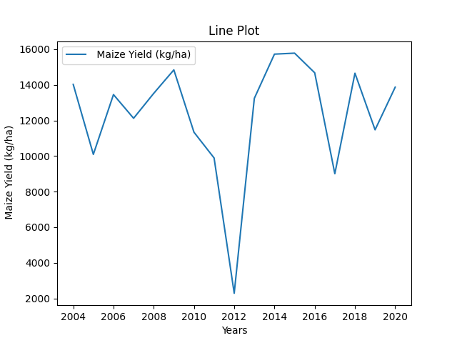

apsimNGpy: The Next Generation Agroecosytem Simulation Library

====================================================================

Our cutting-edge open-source framework, apsimNGpy, empowers advanced agroecosystem modeling through the utilization
of object-oriented principles. It features fast batch file simulation, model prediction, evaluation,
apsimx file editing, seamless weather data retrieval, and efficient soil profile development

Requirements
***********************************************************************************
1. Dotnet, install from https://learn.microsoft.com/en-us/dotnet/core/install/
2. Python3
3. APSIM: Add the directory containing the models executable to the system's PATH or python path (to locate the required .dll files). This can be achieved in either of the following ways:
4. Utilize the APSIM installer provided for this purpose.
5. Build APSIM from its source code. This is comming soon
6. Minimum; 8GM RAM, CPU Core i7

.. _Installation:

Installation

********************************************************************************

All versions are currently in development, phase and they can be installed as follows:

- Method 1. install from PyPI

.. code:: bash

    pip install apsimNGpy

- Method 1. clone the current development repository

.. code:: bash

    git clone https://github.com/MAGALA-RICHARD/apsimNGpy.git
    cd apsimNGpy
    pip install .

- Method 2. Use pip straight away and install from github

.. code:: bash

     pip install git+https://github.com/MAGALA-RICHARD/apsimNGpy.git

GETTING STARTED
*****************************

Before using apsimNGpy, it is necessary to install APSIM. Please follow the instructions provided at the following link to complete the installation: https://www.apsim.info/download-apsim/downloads/
for MAcOS or Linux users see: https://apsimnextgeneration.netlify.app/install/
model documentation and tutorial are also available via; https://docs.apsim.info/
we expect that by accepting to use apsimNGpy, you have a basic understanding of APSIM process-based model, therefore, our focus is to make sure you are able to use apsimNGpy

In addition, make sure that the APSIM installation binaries folder is added to the system path.
if you run the following code and returns None you need to do something as explained below.

- 1. Use command line interface

.. code-block:: bash

     apsim_bin_path -s

- 2. Use apsimNGpy config module

.. code-block:: python

   from apsimNGpy.core import config
      print(config.get_apsim_bin_path())

You can also try to check if automatic search will be successful as follows

.. code-block:: bash

    apsim_bin_path --auto_search

The short cut

.. code-block:: bash

    apsim_bin_path -a

Locating the APSIM Binaries
***************************************************************
By default the APSIM binaries are located automatically. The process for determining the APSIM binary path is as follows:

In apsimNGpy, priority is first given to the user-supplied binary path.
If no path is supplied, the module searches through the Python global environment
using the os module. If that fails, it searches through other folders.
If all approaches are exhausted and no valid path is found, a ValueError will be raised.

Changing/setting the APSIM installation binaries path
*********************************************************************************
If the automatic search fails, please follow one of the steps below to resolve the issue:

1. Manually configure the APSIM binary path. To do this:
*************************************************************************************

In your home folder you could look for folder named apsimNGpy_meta_info './APSIMNGpy_meta_data'
     1. Locate the folder named `APSIMNGpy_meta_info` in your home directory (e.g., `./APSIMNGpy_meta_data`).
     2. Open the file `apsimNGpy_config.ini` within this folder.
     3. Modify the `apsim_location` entry to reflect your desired APSIM binary path.

2. change based os.environ module
************************************

Alternatively, you can use the code at the top of your script as follows

.. code-block:: python

    # Search for the APSIM binary installation path and add it to os.environ as follows:
    import os
    os.environ['APSIM'] = r'path/to/your/apsim/binary/folder/bin'

- Note:

This approach may not work consistently in all scenarios, but you can try it.
The above script line should always be placed at the beginning of your simulation script.
However, why follow this approach when you can achieve the same result more efficiently? See the approach below:

3. Use the apsimNGpy config module:
*****************************************************************

.. code-block:: python
    
    from apsimNGpy.config import set_apsim_bin_path

    # Set the path to the APSIM binaries:
    set_apsim_bin_path(path=r'path/to/your/apsim/binary/folder/bin')

4. Use command line interface
*********************************************************************

After installing apsimNGpy, navigate to your terminal and run the following

.. code-block:: bash

    apsim_bin_path -u 'path/to/your/apsim/binary/folder/bin'

Or

.. code-block:: bash

    apsim_bin_path --update 'path/to/your/apsim/binary/folder/bin'

# Now that the path is set, you can import any module attached to pythonnet.
*********************************************************************************************

.. code-block:: python
    
    # For example, try importing the ApsimModel class:
    from apsimNGpy.core.apsim import ApsimModel

.. _Usage:

The above code is also applicable for running different versions of APSIM models.
The `set_apsim_bin_path` function can be called once and retained unless you uninstall `apsimNGpy`
or the APSIM application itself. This implies that you can switch between apsim versions easily if you have more than one versions installed on your computer

Examples
********

This example demonstrates how to use `apsimNGpy` to load a default simulation, run it, retrieve results, and visualize the output.

.. code-block:: python

    # Import necessary modules
    import apsimNGpy
    from apsimNGpy.core.base_data import load_default_simulations
    from apsimNGpy.core.apsim import ApsimModel as SoilModel
    from pathlib import Path
    import os
    from apsimNGpy.validation.visual import plot_data

The above code imports the necessary modules for running APSIM simulations. This includes `apsimNGpy` modules for loading default simulations and managing results, as well as standard Python libraries for file handling and visualization.

.. code-block:: python

    # Load the default simulation
    soybean_model = load_default_simulations(crop='soybean')  # Case-insensitive crop specification

The `load_default_simulations` function loads a default APSIM simulation for the specified crop. In this example, the crop is set to soybean, but you can specify other crops as needed.

.. code:: python

    # Load the simulation path without initializing the object
    soybean_path_model = load_default_simulations(crop='soybean', simulation_object=False)

If you prefer not to initialize the simulation object immediately, you can load only the simulation path by setting `simulation_object=False`.

.. code-block:: python

    # Initialize the APSIM model with the simulation file path
    apsim = SoilModel(soybean_path_model)

This code initializes the APSIM model using the previously loaded simulation file path.

.. code-block:: python

    # Run the simulation
    apsim.run(report_name='Report')

The `run` method executes the simulation. The `report_name` parameter specifies which data table from the simulation will be used for results.

.. note:
   report_name accepts a list of simulation data tables and hence can return a concatenated pandas data frame for all the data tables
.. code-block:: python

    # Retrieve and save the results
    df = apsim.results
    df.to_csv('apsim_df_res.csv')  # Save the results to a CSV file
    print(apsim.results)  # Print all DataFrames in the storage domain

After the simulation runs, results are stored in the `apsim.results` attribute as pandas DataFrames. Please see note above. These results can be saved to a CSV file or printed to the console.

The code below retrieves the names of simulations from the APSIM model and examines the management modules used in the specified simulations.

.. code-block:: python

    # Examine management modules in the simulation
    sim_name = apsim.simulation_names  # Retrieve simulation names
    apsim.examine_management_info(simulations=sim_name)

You can preview the current simulation in the APSIM graphical user interface (GUI) using the `preview_simulation` method.

.. code-block:: python

    # Preview the current simulation in the APSIM GUI
    apsim.preview_simulation()

.. note::
   apsimNGpy clones a every simulation file before passing it it dotnet runner, however, when you open it in GUI, take note of the version it will be difficult to re-open
   it in the lower versions after opening it in the higher versions of apsim

Visualise the results. please note that python provide very many plotting libraries below is just a basic description of your results

.. code-block:: python

    # Visualize the simulation results
    res = apsim.results['MaizeR']  # Replace with the appropriate report name
    plot_data(df['Clock.Today'], df.Yield, xlabel='Date', ylabel='Soybean Yield (kg/ha)')

Finally, the `plot_data` function is used to visualize the simulation results. Replace 'df['Clock.Today']' and `df.Yield` with the appropriate report name and column from your simulation results.

A graph similar to the example below should appear

Congratulations you have successfully used apsimNGpy package
*********************************************************************************

Change APSIM simulation dates 
*********************************************************************************
.. code-block:: python

    import apsimNGpy
    from apsimNGpy.core.base_data import load_default_simulations
    from apsimNGpy.core.apsim  import ApsimModel as SoilModel
    from pathlib import Path
    import os
    from apsimNGpy.validation.visual import plot_data
    cwd = Path.cwd().home() # sending this to your home folder
    wd = cwd.joinpath("apsimNGpy_demo")
    if not wd.exists():
      os.mkdir(wd)
    # change directory
    os.chdir(wd)
    # Get maize model
    maize_model = load_default_simulations(crop = 'maize')

    maize_model.change_simulation_dates(start_date='01/01/1998', end_date='12/31/2010')

Change  APSIM model management decisions
*********************************************************************************
.. code-block:: python

    # First, examine the manager scripts in the simulation node
    apsim.examine_management_info()
    # now create dictionary holding the parameters. the key to this is that the name of the script manage must be
    passed in the dictionary.

    # in this node we if have a script named the Simple Rotation,we want to change the rotation to maybe Maize, Wheat or
    something else
    rotation  = {'Name': "Simple Rotation", "Crops": 'Maize, Wheat, Soybean'}, # the crops must be seperated my commas
    apsim.update_mgt(management = rotation)
    # now you cans see we passed rotation as a tuple. That means you can add other scripts as your needs suggest. They will all be changed at the
    #same time

Populating the APSIM model with new weather data
*********************************************************************************
.. code-block:: python

    from apsimNGpy.core.weather import daymet_bylocation_nocsv
    lonlat = -93.08, 42.014
    start_year, end_year = 2000, 2002
    wf = daymet_bylocation_nocsv(lonlat, startyear, endyear, filename="mymet.met")
    # you may need to first see what file currently exists in the model
    mis = apsim.show_met_file_in_simulation()
    print(mis)
    # change
    maize_model.replace_met_file(weather_file=wf)
    # check again if you want to
    mis = maize_model.show_met_file_in_simulation()
    print(mis)

Evaluate Predicted Variables
*********************************************************************************
The apsimNGpy Python package provides a convenient way to validate model simulations against measured data. Below 
is a step-by-step guide on how to use the validation.evaluator module from apsimNGpy.

.. code-block:: python

    # Start by importing the required libraries
    from apsimNGpy.validation.evaluator import validate
    import pandas as pd

    # Load the data if external. Replace with your own data
    df = pd.read_csv('evaluation.csv')
    apsim_results = apsim.results  # Assuming 'apsim' is a predefined object from aopsimNGpy.core.core.APSIMN class and contains your simualted results

    # Preparing Data for Validation
    # Extract the relevant columns from your DataFrame for comparison. In this example, we use
    # 'Measured' for observed values and compare them with different model outputs:
    measured = df['Measured']
    predicted = apsim_results['MaizeR'].Yield

    # Now we need to pass both the measured and the observed in the validate class
    val = validate(measured, predicted)

    # Both variables should be the same length, and here we are assuming that they are sorted in the corresponding order

    # There are two options:
    # 1. Evaluate all
    metrics = val.evaluate_all(verbose=True)
    # Setting verbose=True prints all the results on the go; otherwise, a dictionary is returned with the value for each metric

    # 2. Select or pass your desired metric
    RMSE = val.evaluate("RMSE")
    print(RMSE)

    # If you want to see the available metrics, use the code below
    available_metrics = metrics.keys()
    print(available_metrics)
    # Then select your choice from the list

Run factorial experiments faster and efficiently
*********************************************************************************

The apsimNGpy Python package provides a convenient way to run factorial experiments as follows:

.. code-block:: python

    from apsimNGpy.core import base_data
    apsim = base_data.load_default_simulations(crop='Maize')
    apsim.create_experiment(permutation=True)
    apsim.add_factor(specification="[Fertilise at sowing].Script.Amount = 0 to 200 step 20", factor_name='Nitrogen')
    # Use categories
    apsim.add_factor(specification="[Sow using a variable rule].Script.Population = 4, 6, 8, 10", factor_name='Population')
    apsim.run()

It is possible to specify factors related to crop cultivars; all you need is to add a replacement folder and add the crop as a replacement as follows:

.. code-block:: python

    apsim.add_crop_replacements(_crop='Maize')  # Assumes that maize is already present in the simulation
    # Add factor and name it RUE
    apsim.add_factor(specification='[Maize].Leaf.Photosynthesis.RUE.FixedValue = 1.0, 1.23, 4.3', factor_name='RUE')
    apsim.run() # assumes that the database table Name is the default of the Report
    # results can be retrieved in the same way
    df = apsim.results
    
Example output:

.. code-block:: text

    SimulationName  SimulationID  ...     Yield   Zone
    0     ExperimentNitrogen0Population10RUE1.0             8  ...  1379.137  Field
    1     ExperimentNitrogen0Population10RUE1.0             8  ...  1084.340  Field
    2     ExperimentNitrogen0Population10RUE1.0             8  ...     0.000  Field
    3     ExperimentNitrogen0Population10RUE1.0             8  ...   797.680  Field
    4     ExperimentNitrogen0Population10RUE1.0             8  ...  3682.210  Field
                                         ...           ...  ...       ...    ...
    1645  ExperimentNitrogen80Population7RUE4.3           148  ...  4538.774  Field
    1646  ExperimentNitrogen80Population7RUE4.3           148  ...  7549.985  Field
    1647  ExperimentNitrogen80Population7RUE4.3           148  ...  4535.009  Field
    1648  ExperimentNitrogen80Population7RUE4.3           148  ...  8798.415  Field
    1649  ExperimentNitrogen80Population7RUE4.3           148  ...  3236.126  Field
    [1650 rows x 20 columns]

How to Contribute to apsimNGpy
*********************************************************************************
We welcome contributions from the community, whether they are bug fixes, enhancements, documentation updates, or new features. Here's how you can contribute to ``apsimNGpy``:

Reporting Issues
----------------
.. note::
  apsimNGpy is developed and maintained by a dedicated team of volunteers. We kindly ask that you adhere to our community standards when engaging with the project. Please maintain a respectful tone when reporting issues or interacting with community members.

If you find a bug or have a suggestion for improving ``apsimNGpy``, please first check the `Issue Tracker <https://github.com/MAGALA-RICHARD/apsimNGpy/issues>`_ to see if it has already been reported. If it hasn't, feel free to submit a new issue. Please provide as much detail as possible, including steps to reproduce the issue, the expected outcome, and the actual outcome.

Contributing Code
-----------------

We accept code contributions via Pull Requests (PRs). Here are the steps to contribute:

Fork the Repository
^^^^^^^^^^^^^^^^^^^

Start by forking the ``apsimNGpy`` repository on GitHub. This creates a copy of the repo under your GitHub account.

Clone Your Fork
^^^^^^^^^^^^^^^

Clone your fork to your local machine:

  .. code-block:: bash

    git clone https://github.com/MAGALA-RICHARD/apsimNGpy.git
    cd apsimNGpy

Create a New Branch
  Create a new branch for your changes:

  .. code-block:: bash

    git checkout -b your-branch-name

Make Your Changes
  Make the necessary changes or additions to the codebase. Please try to adhere to the coding style already in place.

Test Your Changes
  Run any existing tests, and add new ones if necessary, to ensure your changes do not break existing functionality.

Commit Your Changes
  Commit your changes with a clear commit message that explains what you've done:

  .. code-block:: bash

    git commit -m "A brief explanation of your changes"

Push to GitHub
  Push your changes to your fork on GitHub:

  .. code-block:: bash

    git push origin your-branch-name

Submit a Pull Request
  Go to the ``apsimNGpy`` repository on GitHub, and you'll see a prompt to submit a pull request based on your branch. Click on "Compare & pull request" and describe the changes you've made. Finally, submit the pull request.

Updating Documentation
----------------------

Improvements or updates to documentation are greatly appreciated. You can submit changes to documentation with the same process used for code contributions.

Join the Discussion
-------------------

Feel free to join in discussions on issues or pull requests. Your feedback and insights are valuable to the community!

Version 0.0.27.8 new features
********************************************************************************
Dynamic handling of simulations and their properties

replacements made easier

object oriented factorial experiment set ups and simulations

Acknowledgements
*********************************************************************************
This project, *ApsimNGpy*, greatly appreciates the support and contributions from various organizations and initiatives that have made this research possible. We extend our gratitude to Iowa State University's C-CHANGE Presidential Interdisciplinary Research Initiative, which has played a pivotal role in the development of this project. Additionally, our work has been significantly supported by a generous grant from the USDA-NIFA Sustainable Agricultural Systems program (Grant ID: 2020-68012-31824), underscoring the importance of sustainable agricultural practices and innovations.

We would also like to express our sincere thanks to the APSIM Initiative. Their commitment to quality assurance and the structured innovation program for APSIM's modelling software has been invaluable. APSIM's software, which is available for free for research and development use, represents a cornerstone for agricultural modeling and simulation. For further details on APSIM and its capabilities, please visit `www.apsim.info <http://www.apsim.info>`_.

Our project stands on the shoulders of these partnerships and support systems, and we are deeply thankful for their contribution to advancing agricultural research and development. Please not that that this library is designed as a bridge to APSIM software, and we hope that by using this library, you have the appropriate APSIM license to do so whether free or commercial.

Lastly but not least, ApsimNGpy is not created in isolation but draws inspiration from apsimx, an R package (https://cran.r-project.org/web/packages/apsimx/vignettes/apsimx.html). We acknowledge and appreciate the writers and contributors of apsimx for their foundational work. ApsimNGpy is designed to complement apsimx by offering similar functionalities and capabilities in the Python ecosystem.

# Changelog
******************************************************************************************************

The earlier versions of apsimNGpy were too experimental with a lot of bugs. Therefore tracking started with version 0..29
## [0.29.0] - 2025-01-15

### Added
************************************************************************************

- New logging feature for better debug capability.
- command line interface to run models faster using the command and crop module
- command line interface to change the apsim binary path using the apsim_bin_path module
- more detailed installation documentation

## Fixed
**************************************************************************************

- config module to run on all operating systems
- import of load_default simulations

## [0.3.0] - 2025-01-20
## Fixed
**************************************************************************************

- fixed package to run all latest versions
- handle multiple reports tables in run method, return a concat of the different  data frame

## Added
*****************************************************************************

- APSIMNG.run now return pandas data frame consistently
- files named by default are tagged by the corresponding APSIM installed version
