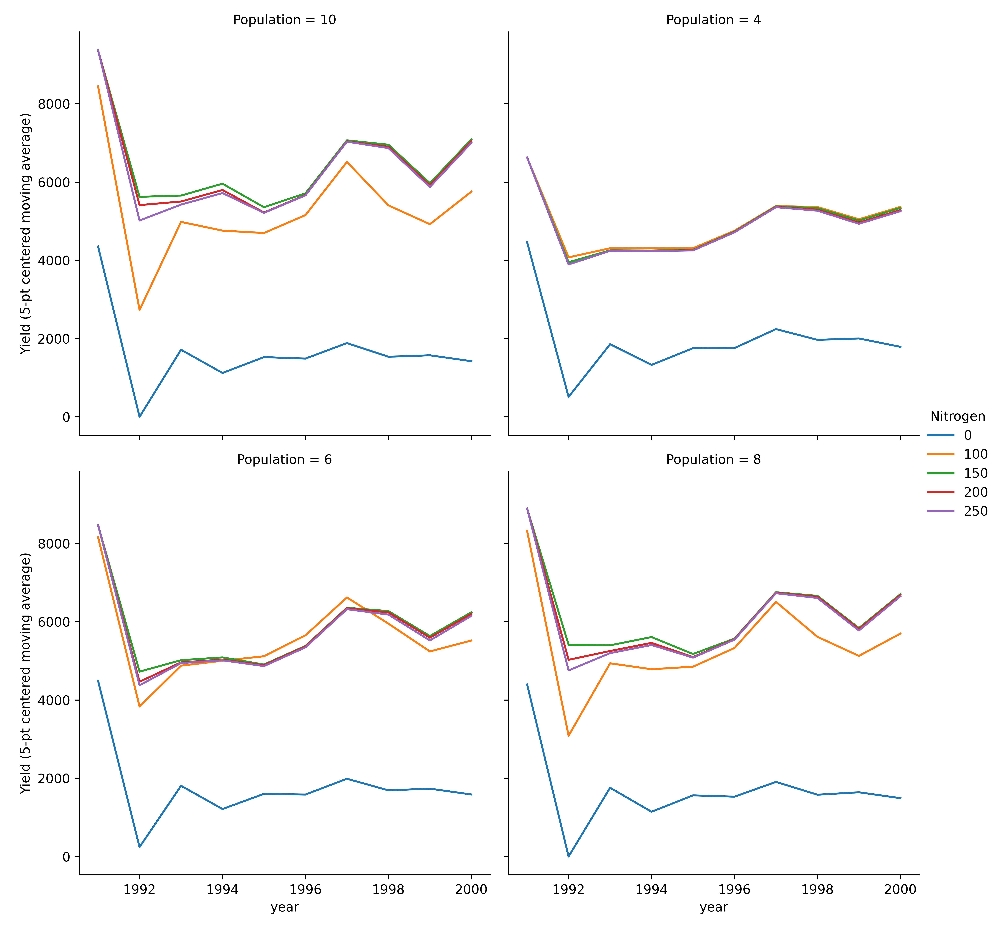
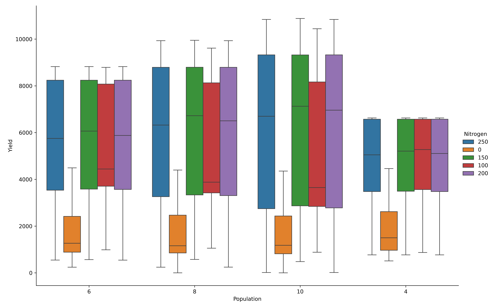

Plotting and Visualizing Simulated Output
=========================================
Visualizing simulated results, is a critical step in understanding and communicating model behavior.
Visualization serves as the blueprint of any experiment as it generates scientific insight underlying the data.
The goal of this tutorial, therefore, is to help you quickly set up, diagnose, and report your simulation outcomes effectively,
enabling clear interpretation and compelling presentation of your results.

.. code-block:: python

    from apsimNGpy.core.experimentmanager import ExperimentManager
    from matplotlib import pyplot as plt

Create the experiment
----------------------
.. code-block:: python

    model = ExperimentManager('Maize', out_path = 'my_experiment.apsimx')
    # init the experiment
    model.init_experiment(permutation =True)

Adding factors to the experiment
--------------------------------
Adding factors to the experiment requires that we understand the model structure. This can be accomplished
by: :meth:`~apsimNGpy.core.experimentmanager.ExperimentManager.inspect_model`, :meth:`~apsimNGpy.core.experimentmanager.ExperimentManager.inspect_file`,
:meth:`~apsimNGpy.core.experimentmanager.ExperimentManager.inspect_model_parameters_by_path`

Inspect the whole simulation tree

.. code-block:: python

   model.inspect_file()

.. code-block:: none

  └── Simulations: .Simulations
    ├── DataStore: .Simulations.DataStore
    └── Experiment: .Simulations.Experiment
        ├── Factors: .Simulations.Experiment.Factors
        │   └── Permutation: .Simulations.Experiment.Factors.Permutation
        └── Simulation: .Simulations.Experiment.Simulation
            ├── Clock: .Simulations.Experiment.Simulation.Clock
            ├── Field: .Simulations.Experiment.Simulation.Field
            │   ├── Fertilise at sowing: .Simulations.Experiment.Simulation.Field.Fertilise at sowing
            │   ├── Fertiliser: .Simulations.Experiment.Simulation.Field.Fertiliser
            │   ├── Harvest: .Simulations.Experiment.Simulation.Field.Harvest
            │   ├── Maize: .Simulations.Experiment.Simulation.Field.Maize
            │   ├── Report: .Simulations.Experiment.Simulation.Field.Report
            │   ├── Soil: .Simulations.Experiment.Simulation.Field.Soil
            │   │   ├── Chemical: .Simulations.Experiment.Simulation.Field.Soil.Chemical
            │   │   ├── NH4: .Simulations.Experiment.Simulation.Field.Soil.NH4
            │   │   ├── NO3: .Simulations.Experiment.Simulation.Field.Soil.NO3
            │   │   ├── Organic: .Simulations.Experiment.Simulation.Field.Soil.Organic
            │   │   ├── Physical: .Simulations.Experiment.Simulation.Field.Soil.Physical
            │   │   │   └── MaizeSoil: .Simulations.Experiment.Simulation.Field.Soil.Physical.MaizeSoil
            │   │   ├── Urea: .Simulations.Experiment.Simulation.Field.Soil.Urea
            │   │   └── Water: .Simulations.Experiment.Simulation.Field.Soil.Water
            │   ├── Sow using a variable rule: .Simulations.Experiment.Simulation.Field.Sow using a variable rule
            │   └── SurfaceOrganicMatter: .Simulations.Experiment.Simulation.Field.SurfaceOrganicMatter
            ├── Graph: .Simulations.Experiment.Simulation.Graph
            │   └── Series: .Simulations.Experiment.Simulation.Graph.Series
            ├── MicroClimate: .Simulations.Experiment.Simulation.MicroClimate
            ├── SoilArbitrator: .Simulations.Experiment.Simulation.SoilArbitrator
            ├── Summary: .Simulations.Experiment.Simulation.Summary
            └── Weather: .Simulations.Experiment.Simulation.Weather

Inspect the full paths to the manager scripts in the model

.. code-block:: python

   model.inspect_model('Models.Manager')

.. code-block:: none

    ['.Simulations.Experiment.Simulation.Field.Sow using a variable rule',
     '.Simulations.Experiment.Simulation.Field.Fertilise at sowing',
     '.Simulations.Experiment.Simulation.Field.Harvest']

Inspect the names to the manager scripts in the model

.. code-block:: python

   model.inspect_model('Models.Manager', fullpath=False)

.. code-block:: none

    ['Sow using a variable rule', 'Fertilise at sowing', 'Harvest']

If we want to edit any of the above script in the experiment, there is need to inspect the associated underlying parameters

1. '.Simulations.Experiment.Simulation.Field.Sow using a variable rule'

.. code-block:: python

  model.inspect_model_parameters_by_path('.Simulations.Experiment.Simulation.Field.Sow using a variable rule')

.. code-block:: python

        {'Crop': 'Maize',
     'StartDate': '1-nov',
     'EndDate': '10-jan',
     'MinESW': '100.0',
     'MinRain': '25.0',
     'RainDays': '7',
     'CultivarName': 'Dekalb_XL82',
     'SowingDepth': '30.0',
     'RowSpacing': '750.0',
     'Population': '6.0'}

2. '.Simulations.Experiment.Simulation.Field.Fertilise at sowing'

.. code-block:: python

   model.inspect_model_parameters_by_path('.Simulations.Experiment.Simulation.Field.Fertilise at sowing')

.. code-block:: python

    {'Crop': 'Maize', 'FertiliserType': 'NO3N', 'Amount': '160.0'}

Add factors along the the paramters; `Amount` and `Population` from the last and first scripts, respectively.

.. code-block:: python

    # Population
    model.add_factor(specification='[Sow using a variable rule].Script.Population = 4, 6, 8, 10', factor_name='Population')
    # Nitrogen fertilizers
    model.add_factor(specification='[Fertilise at sowing].Script.Amount= 0, 100,150, 200, 250', factor_name= 'Nitrogen')

Before we run,let's add one report variable for an easy demonstration

.. code-block:: python

   model.add_report_variable(variable_spec=['[Clock].Today.Year as year'], report_name='Report')
   # run the model to generate output
   model.run()

Inspect the simulated results

.. code-block:: python

    model.results.info()

.. code-block:: python

   <class 'pandas.core.frame.DataFrame'>
    RangeIndex: 200 entries, 0 to 199
    Data columns (total 19 columns):
     #   Column                            Non-Null Count  Dtype
    ---  ------                            --------------  -----
     0   CheckpointID                      200 non-null    int64
     1   SimulationID                      200 non-null    int64
     2   Experiment                        200 non-null    object
     3   Population                        200 non-null    object
     4   Nitrogen                          200 non-null    object
     5   Zone                              200 non-null    object
     6   Clock.Today                       200 non-null    object
     7   Maize.Phenology.CurrentStageName  200 non-null    object
     8   Maize.AboveGround.Wt              200 non-null    float64
     9   Maize.AboveGround.N               200 non-null    float64
     10  Yield                             200 non-null    float64
     11  Maize.Grain.Wt                    200 non-null    float64
     12  Maize.Grain.Size                  200 non-null    float64
     13  Maize.Grain.NumberFunction        200 non-null    float64
     14  Maize.Grain.Total.Wt              200 non-null    float64
     15  Maize.Grain.N                     200 non-null    float64
     16  Maize.Total.Wt                    200 non-null    float64
     17  year                              200 non-null    int64
     18  source_table                      200 non-null    object
    dtypes: float64(9), int64(3), object(7)
    memory usage: 29.8+ KB

# By default, the parameter name of each factor is also populated in the data frame.

Statistical results for each column

.. code-block:: python

   model.results.describe()

.. code-block:: python

          CheckpointID  SimulationID  Maize.AboveGround.Wt  Maize.AboveGround.N  \
        count         200.0    200.000000            200.000000           200.000000
        mean            1.0     10.500000           1067.600206            10.239469
        std             0.0      5.780751            607.686584             6.299485
        min             1.0      1.000000             51.423456             0.320986
        25%             1.0      5.750000            708.023479             5.095767
        50%             1.0     10.500000            987.749088             9.423852
        75%             1.0     15.250000           1579.116949            15.402366
        max             1.0     20.000000           2277.481374            22.475693

                      Yield  Maize.Grain.Wt  Maize.Grain.Size  \
        count    200.000000      200.000000        200.000000
        mean    4765.995363      476.599536          0.245769
        std     3093.295392      309.329539          0.073753
        min        0.000000        0.000000          0.000000
        25%     2535.993006      253.599301          0.223099
        50%     3894.863108      389.486311          0.274101
        75%     7819.712885      781.971288          0.299073
        max    10881.111792     1088.111179          0.315281

               Maize.Grain.NumberFunction  Maize.Grain.Total.Wt  Maize.Grain.N  \
        count                  200.000000            200.000000     200.000000
        mean                  1890.470249            476.599536       6.187685
        std                   1077.127429            309.329539       4.118276
        min                      0.000000              0.000000       0.000000
        25%                    979.352980            253.599301       3.051965
        50%                   1855.994293            389.486311       5.112196
        75%                   2861.250716            781.971288      10.372698
        max                   3726.740206           1088.111179      13.852686

               Maize.Total.Wt         year
        count      200.000000   200.000000
        mean      1167.632796  1995.500000
        std        656.486381     2.879489
        min         53.721510  1991.000000
        25%        774.862931  1993.000000
        50%       1104.093752  1995.500000
        75%       1705.820275  1998.000000
        max       2457.083319  2000.000000

.. code-block:: python

   model.plot_mva(table='Report', response='Yield', time_col='year', col_wrap=2, palette='tab10',
      errorbar=None, estimator='mean', grouping=('Amount', 'Population'), hue='Nitrogen', col='Population')

Multi-year moving average for each experiment.
----------------------------------------------

Categorical Plots
-----------------

Box plots
==========
.. code-block:: python

  model.cat_plot(table = 'Report', y='Yield', x= 'Population', kind = 'box')

Maize yield variability by population density.
----------------------------------------------
.. figure:: ./images/cat_plot_no_hue.png
   :alt: cat plot no hue
   :width: 70%

Add Nitrogen fertilizer as hue for contrast across the nitrogen treatments

.. code-block:: python

    model.cat_plot(table = 'Report', y='Yield', x= 'Population', palette='tab10',
               kind = 'box', hue= 'Nitrogen', height=8, aspect=1.5)
plt.savefig(dir_p/'hue_nitrogen.png', dpi=600)

Maize yield variability by population density and nitrogen fertilizer.
----------------------------------------------

Bar Plots
==========
.. code-block:: python

  model.cat_plot(table = 'Report', y='Yield',
    x= 'Population', kind = 'bar', hue= 'Nitrogen', height=8, aspect=1.5)

Maize yield variability by population density (bar plot).
----------------------------------------------
.. figure:: ./images/bar_plots_no_hue.png
   :alt: bar plot population effect
   :width: 70%

.. code-block:: python

