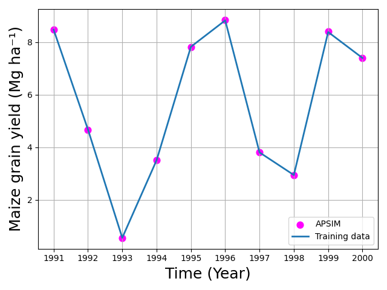

.. meta::
   :description lang=en:
     apsimNGpy supports model calibration through the MixedVariableOptimizer API, providing multiple optimization methods, including differential evolution, for efficient and flexible parameter tuning.

Automatic Parameter calibration
=================================
.. rubric:: Table of Contents

.. contents::
   :local:
   :depth: 2
   :class: compact

This tutorial demonstrates how to automatically calibrate APSIM parameters using the optimization algorithms
available in apsimNGpy. For detailed information on defining and submitting optimization factors,
refer to the API documentation for :meth:`~apsimNGpy.optimizer.problems.smp.MixedProblem.submit_factor`.

.. code-block:: python

        from apsimNGpy.core.config import apsim_bin_context
        # The modules below may require proper APSIM binary path specification install
        from apsimNGpy.optimizer.minimize.single_mixed import MixedVariableOptimizer
        from apsimNGpy.optimizer.problems.smp import MixedProblem
        from apsimNGpy.tests.unittests.test_factory import obs# mimics observed data
        from apsimNGpy.optimizer.problems.variables import UniformVar, QrandintVar

Some algorithms like Differential Evolution can be set to run in parallel, therefore everything needs to be executed below the module guard

Defining the Optimization Problem
----------------------------------

To define an optimization problem that identifies the optimum APSIM parameters, use the class :class:`~apsimNGpy.optimizer.minimize.single_mixed.MixedProblem`.
This class accepts an APSIM template file, a training (observed) dataset, and the corresponding index variables linking observed and simulated data.

A key requirement is to specify a performance metric that serves as the optimization target. This metric guides the algorithm in assessing model performance and convergence quality.
Commonly used metrics include WIA, RMSE, RRMSE, Bias, CCC, R², Slope, ME, and MAE.

An example usage is shown below.

.. code-block:: python

    if __name__ == "__main__":
        # -------------------------------------------------------------
        # 1. Define the mixed-variable optimization problem
        # -------------------------------------------------------------
        mp = MixedProblem(
            model="Maize",
            trainer_dataset=obs,
            pred_col="Yield",
            metric="wia",
            index="year",
            table = 'Report',
            trainer_col="observed"
        )

Defining the factors
---------------------
Once the optimization problem is instantiated, the remaining task is to submit the factors, the parameters that will be sampled during the search process.
These factors finalize the problem specification and determine the parameter space over which the optimization algorithm will operate.

Each factor requires a set of python parameters that define how it will be sampled and handled by apsimNGpy execution engine.
For example, the dictionary below specifies the target model path, the variable type and sampling range,
the starting value, the candidate parameter to modify, and any additional parameters needed by the APSIM model component.

.. code-block:: python

        soil_param = {
            "path": ".Simulations.Simulation.Field.Soil.Organic",
            "vtype": [UniformVar(1, 200)],
            "start_value": [1],
            "candidate_param": ["FOM"],
            "other_params": {"FBiom": 0.04, "Carbon": 1.89},
        }

In general as seen in the example above, the keys in the dictionary above can be broken down as follows;

- **path**: a fully qualified model path pointing to the APSIM component to be edited. For extracting this path, please see :ref:`inspect model section <plain_inspect>`

- **vtype**: A list defining the variable types used for sampling parameter values
  (e.g., ``UniformVar``, ``GridVar``, ``CategoricalVar``). Variable types may also
  be provided as strings.

  Supported Variable Types
  ------------------------

  1. **ChoiceVar(items)**
     Nominal (unordered categorical)
     Example: ``ChoiceVar(["A", "B", "C"])``

  2. **GridVar(values)**
     Ordinal (ordered categorical)
     Example: ``GridVar([2, 4, 8, 16])``

  3. **RandintVar(lower, upper)**
     Integer in ``[lower, upper]``
     Example: ``RandintVar(0, 6)``

  4. **QrandintVar(lower, upper, q)**
     Quantized integer with step ``q``
     Example: ``QrandintVar(0, 12, 3)``

  5. **UniformVar(lower, upper)**
     Continuous float range
     Example: ``UniformVar(0.0, 5.11)``

  6. **QuniformVar(lower, upper, q)**
     Quantized float with step ``q``
     Example: ``QuniformVar(0.0, 5.1, 0.3)``

  Below is a list of allowable string names for each variable type.
  For further details, see :meth:`~apsimNGpy.optimizer.problems.smp.MixedProblem.submit_factor`.

  .. code-block:: python

        ALLOWED_VARIABLES = {
            # Original canonical names
            "UniformVar": UniformVar,
            "QrandintVar": QrandintVar,
            "QuniformVar": QuniformVar,
            "GridVar": GridVar,
            "ChoiceVar": ChoiceVar,
            "RandintVar": RandintVar,

            # Short aliases
            "uniform": UniformVar,
            "quniform": QuniformVar,
            "qrandint": QrandintVar,
            "grid": GridVar,
            "choice": ChoiceVar,
            "randint": RandintVar,

            # Descriptive aliases (readable English)
            "continuous": UniformVar,
            "quantized_continuous": QuniformVar,
            "quantized_int": QrandintVar,
            "ordinal": GridVar,
            "categorical": ChoiceVar,
            "integer": RandintVar,

            # Alternative descriptive (for domain users)
            "step_uniform_float": QuniformVar,
            "step_random_int": QrandintVar,
            "ordered_var": GridVar,
            "choice_var": ChoiceVar
        }

- **start_value**: A list of initial parameter values.
  Each entry corresponds to one parameter within the factor definition
  and is used to seed the optimizer or establish a baseline.

- **candidate_param**: list or tuple of str Names of APSIM variables (e.g., ``"FOM"``, ``"FBiom"``) to be optimized.
            These must exist within the APSIM node path.

- **other_params**: dict — Additional APSIM constants to fix during optimization (non-optimized). These must belong to the same APSIM node. For example, when optimizing ``FBiom`` but also modifying ``Carbon``, supply ``Carbon`` under ``other_params``
  For details see :meth:`~apsimNGpy.core.apsim.ApsimModel.edit_model_by_path`

- **cultivar**: bool  Indicates whether the parameter belongs to a cultivar node. Set to
            ``True`` when defining cultivar-related optimization factors.

.. tip::

    - Each distinct node on APSIM should appear in one single entry or submission, hence if they are multiple paramters on a single node, they should all be defined by a single entry
    - When a factor contains multiple parameters, the fields ``vtype``, ``start_value``, and ``candidate_param`` provided as a list must be the same size as the number of parameters to optimize on that node and should be the same length

For the example above, if multiple parameters at the same model path need to be optimized, they can be defined as follows:

.. code-block:: python

        soil_param = {
            "path": ".Simulations.Simulation.Field.Soil.Organic",
            "vtype": [UniformVar(1, 200), UniformVar(1, 3)],
            "start_value": [1, 2],
            "candidate_param": ["FOM", 'Carbon'],
            "other_params": {"FBiom": 0.04, },
        }

Cultivar-specific parameters can be defined as shown below. Note that if you do not explicitly set cultivar=True, the factor may still pass Pydantic validation,
but it will not be recognized correctly by apsimNGpy. As a result, an error will be raised when the optimizer starts.

.. code-block:: python

        cultivar_param = {
            "path": ".Simulations.Simulation.Field.Maize.CultivarFolder.Dekalb_XL82",
            "vtype": [ QrandintVar(400, 900, q=10), UniformVar(0.8,2.2)],  # Discrete step size of 10 for the first factor
            "start_value": [ 600, 1],
            "candidate_param": [
                                '[Phenology].GrainFilling.Target.FixedValue',
                                '[Leaf].Photosynthesis.RUE.FixedValue'],
            "other_params": {"sowed": True},
            "cultivar": True,  # Signals to apsimNGpy to treat it as a cultivar parameter
        }

Cultivar specific paramters are still tricky, as there is need to specify whether the cultivar to be
edited is the one specified in the manager script managing the sowing operations. There are also situations where you may want to
optimize the parameters of a cultivar **that is not the one currently
specified in the manager script**. In such cases, you have two options.
The first option is to explicitly indicate that the cultivar is **not yet
sown** in the simulation, while also providing the path to the manager
script responsible for sowing it. This ensures that
**apsimNGpy** updates the cultivar name dynamically during optimization.

An example configuration is shown below:

.. code-block:: python

    cultivar_param = {
        "path": ".Simulations.Simulation.Field.Maize.CultivarFolder.Dekalb_XL82",
        "vtype": [
            QrandintVar(400, 900, q=10),
            UniformVar(0.8, 2.2)
        ],
        "start_value": [600, 1],
        "candidate_param": [
            "[Phenology].GrainFilling.Target.FixedValue",
            "[Leaf].Photosynthesis.RUE.FixedValue"
        ],
        "other_params": {
            "sowed": False,
            "manager_path": ".Simulations.Simulation.Field.Sow using a variable rule",
            "manager_param": "CultivarName",
        },
        "cultivar": True,  # Informs apsimNGpy that this is a cultivar-based parameter set
    }

A more recommended and straightforward approach is to **update the
``CultivarName`` in the manager script to the cultivar you intend to
calibrate**, and then proceed exactly as in the first example. This avoids
the need to specify ``sowed=False`` and providing extra information such as the manager script path, and the associated param name.

The following example demonstrates how to modify the cultivar name
programmatically before defining the optimization problem, but you can also do this in the GUI

.. code-block:: python

    from apsimNGpy.core.apsim import ApsimModel

    # Load your APSIM template (replace with your actual template path)
    model = ApsimModel("Maize")

    # Update the cultivar used in the sowing manager rule
    model.edit_model_by_path(
        path=".Simulations.Simulation.Field.Sow using a variable rule",
        CultivarName="Dekalb_XL82"
    )

    # After editing, extract the updated model path for use in the optimization setup
    edited_path = 'edited_path.apsimx'
    model.save(edited_path, reload =False) # no need to reload it back in memory

Use ``edited_path`` in the problem definition above when specifying the
template for calibration. This ensures that when defining the associated factors, we just signal that cultivar is sowed and no extra arguments are needed.

.. note::

  If you are using Operations, it is not currently supported

Submit optimization factors
------------------------------

.. code-block:: python

        mp.submit_factor(**soil_param)
        # submit the cultivar one
        mp.submit_factor(**cultivar_param)

        print(f" {mp.n_factors} optimization factors registered.")
         #4 optimization factors registered.")
.. tip::

without value unpacking, we can submit variables directly as follows:

.. code-block:: python

   mp.submit_factor(
       path=".Simulations.Simulation.Field.Maize.CultivarFolder.Dekalb_XL82",
       vtype=[
           QrandintVar(400, 900, q=10),
           UniformVar(0.8, 2.2),
       ],
       start_value=[600, 1],
       candidate_param=[
           "[Phenology].GrainFilling.Target.FixedValue",
           "[Leaf].Photosynthesis.RUE.FixedValue",
       ],
       other_params={
           "sowed": False,
           "manager_path": ".Simulations.Simulation.Field.Sow using a variable rule",
           "manager_param": "CultivarName",
       },
       cultivar=True,  # Informs apsimNGpy that this is a cultivar-based parameter set
   )

There is still a chance to submit all defined factors at once

.. code-block:: python

  mp.submit_all([soil_param,cultivar_param ])

Submitting  untyped factors
-----------------------------
Factors may be submitted without explicitly specifying a variable type (e.g., UniformVar or ChoiceVar). In this case, all
submitted factors are treated as continuous (float) variables by default. This approach is appropriate when the decision variables are purely numeric and bounded,
and it avoids the additional overhead of defining explicit variable-type wrappers. An example of this usage is shown below:

.. code-block:: python

    mp.submit_factor(path='.Simulations.Replacements.Maize.OPVPH4edited',
                             candidate_param=[
                                 '[Leaf].Photosynthesis.RUE.FixedValue',
                                 '[Phenology].GrainFilling.Target.FixedValue',
                                 '[Phenology].Juvenile.Target.FixedValue',
                                 '[Phenology].FloweringToGrainFilling.Target.FixedValue'
                             ],
                             bounds=[[1, 2.4], [600, 850], [200, 260], [100,200]],
                             start_value=[ 1.8, 800,200, 100],
                             other_params={'sowed':True},
                             cultivar=True)

.. note::

   The code examples above are intended only to demonstrate how factors
   *can* be submitted to the optimizer. In this tutorial, however,
   **only cultivar parameters were actually passed to the optimizer** for
   calibration. All other factors shown in the examples are for
   illustration purposes and were not included in the optimization
   example below.

.. tip::

       All submitted factors are validated using `Pydantic <https://docs.pydantic.dev/latest/>`__.
 to ensure adherence to expected data structures and variable types — for example checking that
       ``vtype`` includes valid variable types (``UniformVar``, ``GridVar``),
       ensuring ``path`` is a valid string, and that start_values is a string.

       After Pydantic validation, an additional structural check ensures that the
       lengths of ``vtype``, ``start_value``, and ``candidate_param`` are identical.
       Each candidate parameter must have a matching variable type and initial
       value.

       In cases where `other_params` has identical names as `candidate_param`, the `candidate_param`
       takes priority and the identical parameter is decoupled from the other_params

       Optimization methods that do not require bounded or initialized start
       values allow for dummy entries in ``start_value``. These placeholders are
       accepted without affecting the optimization process. The system remains
       flexible across both stochastic and deterministic search methods.

Configure the optimizer
--------------------------
.. code-block:: python

        minim = MixedVariableOptimizer(problem=mp)

Use differential evolution
---------------------------
apsimNGpy provides a high-level wrapper for Differential Evolution
(DE), enabling robust APSIM calibration without requiring users to
manage low-level evolutionary mechanics. DE is well suited to the
irregular, nonlinear parameter landscapes common in crop and soil
model calibration. Its population-based search balances broad
exploration with fine-scale refinement. Effective performance is
typically achieved using moderate population sizes (20–40), but you may consider making the population as 10 * number of parameters, mutation
factors between 0.6 and 0.9, and crossover rates between 0.7 and
0.9. For metrics where larger values indicate improved model
performance (such as WIA, CCC, R², and slope), apsimNGpy internally
transforms the problem into a minimization task, which requires
negative constraint bounds. Parallel execution via the ``workers``
argument is essential for reducing computation time during APSIM
simulations.

.. note::

   The observed dataset (``obs``) was generated using the maize cultivar
   **Dekalb_XL82**, with the following true parameter values:
   ``[Phenology].GrainFilling.Target.FixedValue = 813`` and
   ``[Leaf].Photosynthesis.RUE.FixedValue = 2.0``.
   Therefore, an effective optimization algorithm should be able to
   recover parameter values that closely match these targets when
   calibrating against the observed data.

.. code-block:: python

        de = minim.minimize_with_de(
            use_threads=True,
            updating="deferred", # recommended if workers > 1, otherwise use 'immediate'
            workers=14,
            popsize=30,
            maxiter=15,  # ~generations
            tol=1e-6,
            mutation=(0.5, 1.0),  # differential weight (can be tuple for dithering)
            recombination=0.7,  # crossover prob
            seed=42,  # reproducibility
            polish=True,  # local search at the end (uses L-BFGS-B) or trust-constr if the problem ahs constraint
            constraints=(-1.1, -0.8))
        print(de)

.. admonition:: result retrieval
   :class: highlight

    After optimization is completed, we can print the instance of the minimization and for the above code see example below,
    please note the illustration did not include the soil params, because of time constraints.

.. code-block:: none

     message: Optimization terminated successfully.
             success: True
                 fun: -0.9999574183647046
                   x: (800, 1.9847370688789152)
                 nit: 5
                nfev: 604
          population: [[ 7.788e+02  1.983e+00]
                       [ 8.787e+02  2.092e+00]
                       ...
                       [ 7.743e+02  1.998e+00]
                       [ 7.054e+02  1.980e+00]]
 population_energies: [-1.000e+00 -9.978e-01 ... -9.998e-01 -9.995e-01]
              constr: [array([ 0.000e+00])]
    constr_violation: 0.0
               maxcv: 0.0
                 jac: [array([[-3.952e-06,  1.323e-03]]), array([[ 1.000e+00,  0.000e+00],
                             [ 0.000e+00,  1.000e+00]])]
              x_vars: [Phenology].GrainFilling.Target.FixedValue: 800
                            [Leaf].Photosynthesis.RUE.FixedValue: 1.9847370688789152
         all_metrics:  RMSE: 35.8565186378257
                        MAE: 27.500786187035384
                        MSE: 1285.689928824742
                      RRMSE: 0.006361340117450984
                       bias: 0.791396068637448
                         ME: 0.9998296586187999
                        WIA: 0.9999574183647046
                         R2: 0.9998297877255155
                        CCC: 0.9999148445037384
                      SLOPE: 1.000044541525716
                data:    year  observed        Yield
                      0  1991  8469.616  8525.106322
                      1  1992  4674.820  4666.814543
                      2  1993   555.017   550.891724
                      3  1994  3504.282  3505.616103
                      4  1995  7820.120  7748.800048
                      5  1996  8823.516  8856.269351
                      6  1997  3802.295  3854.178136
                      7  1998  2943.070  2926.598323
                      8  1999  8379.928  8361.239740
                      9  2000  7393.633  7378.696671

.. admonition:: Highlight

    Under the default parameter settings, result from DE algorithms was acceptable but at a very higher cost  of **604 function
    evaluations**

.. tip::

   Differential Evolution (DE) is computationally intensive, especially
   when the number of parameters (decision variables) is large. Each
   generation evaluates the full population of candidate solutions, which
   can significantly increase computation time for APSIM-based calibration.
   In many cases, simpler local optimization algorithms (e.g.,
   Nelder–Mead, Powell, or L-BFGS-B) may achieve comparable performance
   with far fewer evaluations. Users are encouraged to try these
   lower-cost local methods first, and adopt DE only when local
   algorithms consistently fail to identify satisfactory solutions or
   when the objective landscape is highly irregular or multi-modal.

Local optimization examples
---------------------------
Below are the results from one of the several local optimization algorithms included
in ``apsimNGpy``. These methods generally
require **far fewer APSIM evaluations**.

.. code-block:: python

        nelda = minim.minimize_with_local(method="Nelder-Mead")
        print(nelda)

.. code-block:: none

    nelda-mead
            message: Optimization terminated successfully.
           success: True
            status: 0
               fun: -0.9999978063483224
                 x: (810, 1.9956845806066088)
               nit: 74
              nfev: 157
     final_simplex: (array([[ 8.086e+02,  1.996e+00],
                           [ 8.086e+02,  1.996e+00],
                           [ 8.086e+02,  1.996e+00]]), array([-1.000e+00, -1.000e+00, -1.000e+00]))
            x_vars: [Phenology].GrainFilling.Target.FixedValue: 810
                          [Leaf].Photosynthesis.RUE.FixedValue: 1.9956845806066088
       all_metrics:  RMSE: 8.142916753128027
                      MAE: 6.182601974125896
                      MSE: 66.30709324837308
                    RRMSE: 0.001444642842712912
                     bias: 0.2038095028286307
                       ME: 0.9999912149565816
                      WIA: 0.9999978063483224
                       R2: 0.9999926474869694
                      CCC: 0.9999956129811112
                    SLOPE: 1.0011872254349912
              data:    year  observed        Yield
                    0  1991  8469.616  8466.879175
                    1  1992  4674.820  4668.921189
                    2  1993   555.017   552.965145
                    3  1994  3504.282  3500.529818
                    4  1995  7820.120  7814.047377
                    5  1996  8823.516  8839.941004
                    6  1997  3802.295  3800.652670
                    7  1998  2943.070  2942.571063
                    8  1999  8379.928  8395.435053
                    9  2000  7393.633  7386.392601

.. admonition:: Highlight

    The Nelder–Mead solution provides a **near-perfect** fit (WIA ≈ 0.999998)
    using **only 157 evaluations**, compared to 604 for DE. The resulting RMSE
    of approximately 8 kg ha⁻¹ is effectively negligible, and the estimated
    slope is essentially 1.0. Together, these indicators demonstrate that the
    Nelder–Mead algorithm solved this calibration problem with exceptional
    precision.

.. code-block:: python

        powell = minim.minimize_with_local(method="Powell")
        print(powell)

.. code-block:: none

     Powell      message: Optimization terminated successfully.
     success: True
      status: 0
         fun: -0.9999978063480863
           x: (810, 1.9956853031734851)
         nit: 3
       direc: [[ 1.778e-04  8.225e-06]
               [ 1.256e+02  5.083e-02]]
        nfev: 156
      x_vars: [Phenology].GrainFilling.Target.FixedValue: 810
                    [Leaf].Photosynthesis.RUE.FixedValue: 1.9956853031734851
 all_metrics:  RMSE: 8.142918248897413
                MAE: 6.181338616665698
                MSE: 66.3071176082265
              RRMSE: 0.0014446431080788248
               bias: 0.20602073354134517
                 ME: 0.9999912149533542
                WIA: 0.9999978063480863
                 R2: 0.9999926482235774
                CCC: 0.9999956129866351
              SLOPE: 1.0011874855510992
        data:    year  observed        Yield
              0  1991  8469.616  8466.882313
              1  1992  4674.820  4668.923545
              2  1993   555.017   552.965793
              3  1994  3504.282  3500.531051
              4  1995  7820.120  7814.050446
              5  1996  8823.516  8839.943474
              6  1997  3802.295  3800.654636
              7  1998  2943.070  2942.572631
              8  1999  8379.928  8395.437323
              9  2000  7393.633  7386.395996

.. admonition:: Highlight

    Powell achieved the **same objective value** as Nelder–Mead and also used
    about **four times fewer evaluations than DE**.

.. code-block:: python

        lbfgs = minim.minimize_with_local(method="L-BFGS-B", options={
            "gtol": 1e-12,
            "ftol": 1e-12,
            "maxfun": 50000,
            "maxiter": 30000
        })

        print(lbfgs)

.. code-block:: none

      L-BFGS-B
      message: CONVERGENCE: RELATIVE REDUCTION OF F <= FACTR*EPSMCH
     success: True
      status: 0
         fun: -0.9988328727487307
           x: (600, 1.9146364126155142)
         nit: 5
         jac: [ 0.000e+00  1.443e-06]
        nfev: 51
        njev: 17
    hess_inv: <2x2 LbfgsInvHessProduct with dtype=float64>
      x_vars: [Phenology].GrainFilling.Target.FixedValue: 600
                    [Leaf].Photosynthesis.RUE.FixedValue: 1.9146364126155142
 all_metrics:  RMSE: 186.2985473377376
                MAE: 138.99280660263236
                MSE: 34707.14874015126
              RRMSE: 0.03305140788967166
               bias: -12.88563869699999
                 ME: 0.9954016411567299
                WIA: 0.9988328727487307
                 R2: 0.9955620314856154
                CCC: 0.9976695795042819
              SLOPE: 0.9838241649224034
        data:    year  observed        Yield
              0  1991  8469.616  8627.900365
              1  1992  4674.820  4618.992002
              2  1993   555.017   525.631735
              3  1994  3504.282  3465.150544
              4  1995  7820.120  7726.613326
              5  1996  8823.516  8629.615403
              6  1997  3802.295  4274.546474
              7  1998  2943.070  2827.247588
              8  1999  8379.928  8205.456985
              9  2000  7393.633  7336.286190

.. admonition:: highlight

    Although extremely fast (only 51 evaluations), L-BFGS-B performed worse
    than Powell and Nelder–Mead due to the non-smooth nature of the parameters used in this tutorial.

.. code-block:: python

        bfgs = minim.minimize_with_local(method="BFGS")
        print(bfgs)

        print("\nOptimization completed:")

After the optimization is completed, compare the simulated results with the training dataset
using the newly optimized parameters. The data attribute contains both the observed and simulated datasets, enabling direct comparison and evaluation of model performance.

.. code-block:: python

        import matplotlib.pyplot as plt
        import os
        # sns.relplot(x="year", y="y")
        plt.figure(figsize=(8, 6))
        df= de.data
        df.eval('ayield =Yield/1000', inplace=True)
        df.eval('oyield =observed/1000', inplace=True)
        # observed → scatter points
        plt.scatter(df["year"], df["ayield"], label="APSIM", s=60, color='red')
        # predicted → line
        plt.plot(df["year"], df["oyield"], label="Training data", linewidth=2)
        plt.xlabel("Time (Year)", fontsize=18)
        plt.ylabel("Maize grain yield (Mg ha⁻¹)", fontsize=18)
        plt.title("") #Observed vs Predicted Yield Over Time
        plt.legend()
        plt.grid(True)
        plt.tight_layout()
        plt.savefig("figures.png")
        os.startfile("figures.png")
        plt.close()

Differential Evolution Performance and Comparison with Local Optimizers
-------------------------------------------------------------------------

In this example, Differential Evolution (DE) was used to calibrate two
APSIM parameters: **[Phenology].GrainFilling.Target.FixedValue** and
**[Leaf].Photosynthesis.RUE.FixedValue**. Although DE is robust for
non-convex and multi-modal landscapes, the results in this case show that
DE performed **relatively poorly compared to simpler local optimization
methods**, both in terms of computation time and final calibration
accuracy. These results were obtained using the **default DE settings** in
``apsimNGpy``. With additional parameter tuning—such as adjusting the
mutation factor (``F``), crossover rate (``recombination``), population size, or
evolution strategy—DE performance may improve and potentially match the
accuracy achieved by Nelder–Mead or Powell. However, such tuning increases
computational cost and may require multiple exploratory runs to identify
effective settings.

Full tutorial code:
-------------------
.. code-block:: python

    from apsimNGpy.optimizer.minimize.single_mixed import MixedVariableOptimizer
    from apsimNGpy.optimizer.problems.smp import MixedProblem
    from apsimNGpy.optimizer.problems.variables import UniformVar, QrandintVar
    from apsimNGpy.tests.unittests.test_factory import obs
    if __name__ == "__main__":
        # -------------------------------------------------------------
        # 1. Define the mixed-variable optimization problem
        # -------------------------------------------------------------
        mp = MixedProblem(
            model="Maize",
            trainer_dataset=obs,
            pred_col="Yield",
            metric="wia",
            index="year",
            trainer_col="observed"
        )
        # A cultivar specific parameter
        cultivar_param = {
            "path": ".Simulations.Simulation.Field.Maize.CultivarFolder.Dekalb_XL82",
            "vtype": [QrandintVar(400, 900, q=10), UniformVar(0.8, 2.2)],  # Discrete step size of 2
            "start_value": [600, 1],
            "candidate_param": [
                '[Phenology].GrainFilling.Target.FixedValue',
                '[Leaf].Photosynthesis.RUE.FixedValue'],
            "other_params": {"sowed": True},
            "cultivar": True,  # Signals to apsimNGpy to treat it as a cultivar parameter
        }
        # Submit optimization factors
        mp.submit_factor(**cultivar_param)
        print(f" {mp.n_factors} optimization factors registered.")
        # -------------------------------------------------------------
        # 3. Configure and execute the optimizer
        # -------------------------------------------------------------
        minim = MixedVariableOptimizer(problem=mp)
        #_______________________________________________
        # use differential evolution
        de = minim.minimize_with_de(
            use_threads=True,
            updating="deferred",
            workers=14,  # Number of parallel workers
            popsize=30,  # Population size per generation
            constraints=(-1.1, -0.8),     # if metric indicator is one of wia, ccc , r2, slope the constraints must be negative
        )
        print("Differential evolution\n", de)

Local optimization examples
---------------------------
.. code-block:: python

        nelda = minim.minimize_with_local(method="Nelder-Mead")
        print('nelda\n', nelda)
        powell = minim.minimize_with_local(method="Powell")
        print('Powell', powell)
        lbfgs = minim.minimize_with_local(method="L-BFGS-B", options={
            "gtol": 1e-12,
            "ftol": 1e-12,
            "maxfun": 50000,
            "maxiter": 30000})
        print(lbfgs)
        bfgs = minim.minimize_with_local(method="BFGS")
        print('bfgs\n', bfgs)

        print("\nOptimization completed:")
        # ----------------------------------
        # now plot the results
        # ---------------------------------
        import matplotlib.pyplot as plt
        import os
        plt.figure(figsize=(8, 6))
        df= de.data
        df.eval('ayield =Yield/1000', inplace=True)
        df.eval('oyield =observed/1000', inplace=True)
        # observed → scatter points
        plt.scatter(df["year"], df["ayield"], label="APSIM", s=60, color='red')
        # predicted → line
        plt.plot(df["year"], df["oyield"], label="Training data", linewidth=2)
        plt.xlabel("Time (Year)", fontsize=18)
        plt.ylabel("Maize grain yield (Mg ha⁻¹)", fontsize=18)
        plt.title("") #Observed vs Predicted Yield Over Time
        plt.legend()
        plt.grid(True)
        plt.tight_layout()
        plt.savefig("figures.png")
        if hasattr(os, 'startfile'):
           os.startfile("figures.png")
        plt.close()

.. seealso::

    - :ref:`API Reference <api_ref>`
    - :ref:`Download Stable APSIM Version here <apsim_pin_version>`
    - :ref:`Go back to the home page<master>`
