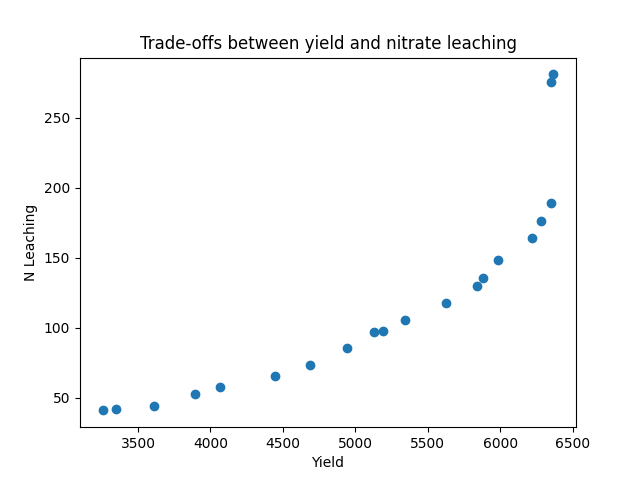

.. _cheat:

apsimNGpy cheatsheet
==========================
1. Installing apsimNGpy

Installing from PyPI

.. code-block:: console

   pip install apsimNGpy

Installing from GitHub

.. code-block:: console

    pip install git+https://github.com/MAGALA-RICHARD/apsimNGpy.git

Providing the installed APSIM binaries.

1. Use the terminal. When apsimNGpy is installed, it creates a command line module ``apsim_bin_path``

.. code-block:: console

    apsim_bin_path -u 'path/to/your/apsim/binary/folder/bin'

2. Use the config module

.. code-block:: python

    from apsimNGpy.core.config import set_apsim_bin_path
    set_apsim_bin_path(path=r'path/to/your/apsim/binary/folder/bin')

Getting the APSIM binary path

1. Use the terminal

.. code-block:: console

    apsim_bin_path -s

2. Use the config module

.. code-block:: python

   from apsimNGpy.core import config
   print(config.get_apsim_bin_path())

Viewing apsimNGpy version

.. code-block:: python

    import apsimNGpy
    apsimNGpy.__version__

What about the APSIM version?

.. code-block:: python
    from apsimNGpy.core.config import apsim_version
    print(apsim_version())

Instantiating apsimNGpy Model Objects
You can either load a built-in template or use your own APSIM file

Load the factory default model

.. code-block:: python

    from apsimNGpy.core import base_data

# Option 1: Load default maize simulation

.. code-block:: python

    model = base_data.load_default_simulations(crop='Maize')

Option 2: Equivalent direct instantiation. Supported by versions 0.35 +

.. code-block:: python

    from apsimNGpy.core.apsim import ApsimModel
    model = ApsimModel(model='Maize', out_path = './maize.apsimx')
    # other crops inlcude: Pinus, Barley, Soybean, EucalyptusRotation, Eucalyptus,
    # Sugarcane, Oats, WhiteClover, Sorghum, Potato, Canola, Chickpea, RedClover, Mungbean etc.

2. Load the model from a file on the computer disk

.. code-block:: python
    from apsimNGpy.core.apsim import ApsimModel
    model = ApsimModel(model='./Maize.apsimx', out_path = './maize.apsimx')

Running loaded models

.. code-block:: python

    from apsimNGpy.core.apsim import ApsimModel
    model = ApsimModel('Pinus')
    model.run()

Retrieving simulated results

.. code-block:: python

    df = model.results
    df.to_csv('apsim_df_res.csv')  # Save the results to a CSV file
    print(model.results)

extract target report table

.. code-block:: python

    model.get_simulated_output("Report)

Saving the edited file or model

.. code-block:: python

    model.save('./simulated_pinus.apsimx')

Method chaining

.. code-block:: python

     df = model('Maize').run().results # terminates to returning a data frame

Inspecting model structure

Most of the time, when modifying model parameters and values, you need the full path to the specified APSIM model. This is where the inspect_model method becomes useful—it allows you to inspect the model without opening the file in the APSIM GUI.

.. code-block:: python

    from apsimNGpy.core.apsim import ApsimModel
    model = ApsimModel(model= 'Maize')

Finding the path to the manager modules

.. code-block:: python

    model.inspect_model('Models.Manager', fullpath=True)

Output

.. code-block:: python

   [.Simulations.Simulation.Field.Sow using a variable rule',
   '.Simulations.Simulation.Field.Fertilise at sowing',
    '.Simulations.Simulation.Field.Harvest']

Names only

.. code-block:: python

    model.inspect_model('Models.Manager', fullpath=False)
    # output
    ['Sow using a variable rule', 'Fertilise at sowing', 'Harvest']

Getting the names of the simulations in the loaded file

.. code-block:: python

    model.inspect_model('Models.Core.Simulation', fullpath=False)
    # Output
    ['Simulation']

The models from APSIM Models namespace are abstracted to use strings. but you can still play around with the Models namespace as follows:

.. code-block:: python

    from apsimNGpy.core.core import Models
    model.inspect_model(Models.Core.Simulation, fullpath=False)

    # Output
    ['Simulation']

Whole Model inspection

.. code-block:: python

    model.inspect_file()

Inspecting model parameters:

1. Using ``inspect_model_parameters``

.. code-block:: python

    from apsimNGpy.core import ApsimModel
    model = ApsimModel('Maize')

Inspect the full soil Organic profile:

.. code-block:: python

        model.inspect_model_parameters('Organic', simulations='Simulation', model_name='Organic')

# output

.. code-block:: python

           CNR  Carbon      Depth  FBiom  ...         FOM  Nitrogen  SoilCNRatio  Thickness
        0  12.0    1.20      0-150   0.04  ...  347.129032     0.100         12.0      150.0
        1  12.0    0.96    150-300   0.02  ...  270.344362     0.080         12.0      150.0
        2  12.0    0.60    300-600   0.02  ...  163.972144     0.050         12.0      300.0
        3  12.0    0.30    600-900   0.02  ...   99.454133     0.025         12.0      300.0
        4  12.0    0.18   900-1200   0.01  ...   60.321981     0.015         12.0      300.0
        5  12.0    0.12  1200-1500   0.01  ...   36.587131     0.010         12.0      300.0
        6  12.0    0.12  1500-1800   0.01  ...   22.191217     0.010         12.0      300.0
        [7 rows x 9 columns]

Inspect soil Physical profile:

.. code-block:: python

    model.inspect_model_parameters('Physical', simulations='Simulation', model_name='Physical')

# output

.. code-block:: python

        AirDry        BD       DUL  ...        SWmm Thickness  ThicknessCumulative
    0  0.130250  1.010565  0.521000  ...   78.150033     150.0                150.0
    1  0.198689  1.071456  0.496723  ...   74.508522     150.0                300.0
    2  0.280000  1.093939  0.488438  ...  146.531282     300.0                600.0
    3  0.280000  1.158613  0.480297  ...  144.089091     300.0                900.0
    4  0.280000  1.173012  0.471584  ...  141.475079     300.0               1200.0
    5  0.280000  1.162873  0.457071  ...  137.121171     300.0               1500.0
    6  0.280000  1.187495  0.452332  ...  135.699528     300.0               1800.0
    [7 rows x 17 columns]

Inspect soil Chemical profile:

.. code-block:: python

    model.inspect_model_parameters('Chemical', simulations='Simulation', model_name='Chemical')

    # output
           Depth   PH  Thickness
    0      0-150  8.0      150.0
    1    150-300  8.0      150.0
    2    300-600  8.0      300.0
    3    600-900  8.0      300.0
    4   900-1200  8.0      300.0
    5  1200-1500  8.0      300.0
    6  1500-1800  8.0      300.0
Getting the current weather/met file

.. code-block:: python

    model.inspect_model_parameters('Weather', simulations='Simulation',
                            model_name='Weather')

    # output
    '%root%/Examples/WeatherFiles/AU_Dalby.met'

Inspect Manager script parameters.

.. code-block:: python

    model.inspect_model_parameters('Manager',
    simulations='Simulation', model_name='Sow using a variable rule')

    # output
    {'Crop': 'Maize',
    'StartDate': '1-nov',
    'EndDate': '10-jan',
    'MinESW': '100.0',
    'MinRain': '25.0',
    'RainDays': '7',
    'CultivarName': 'Dekalb_XL82',
    'SowingDepth': '30.0',
    'RowSpacing': '750.0',
    'Population': '10'}

Specify a few parameters

.. code-block:: python

    model.inspect_model_parameters('Manager',
    simulations='Simulation', model_name='Sow using a variable rule',
                 parameters=['Population'])

    # output
    {'Population': '10'}

The primary limitation of inspect_model_parameters is its verbosity — it often requires passing model_type, model_name and simulations or navigating deeply nested structures.

The inspect_model_parameters_by_path method addresses this verbosity problem by allowing users to simply specify the path to the model component and (optionally) the parameters to inspect. This makes the API more concise and user-friendly.

Inspect SurfaceOrganicMatter module parameters

.. code-block:: python

    model = ApsimModel('Maize')
    model.inspect_model_parameters_by_path('.Simulations.Simulation.Field.SurfaceOrganicMatter')

# output

.. code-block:: python

    {'InitialCPR': 0.0,
      'InitialCNR': 100.0,
      'NH4': 0.0,
      'NO3': 0.0,
      'Cover': 0.0,
      'LabileP': 0.0,
      'N': 0.0,
      'SurfOM': <System.Collections.Generic.List[SurfOrganicMatterType] object at 0x1ae5c10c0>,
      'InitialResidueMass': 500.0,
      'LyingWt': 0.0,
      'StandingWt': 0.0,
      'C': 0.0,
      'P': 0.0}

Inspect the surface organic matter module parameters by selecting a few parameters

.. code-block:: python

    model.inspect_model_parameters_by_path('.Simulations.Simulation.Field.SurfaceOrganicMatter',
     parameters = 'InitialCNR')

 # output

.. code-block:: python

    {'InitialCNR': 100.0}

If all the above is not enough, view the file in the GUI

.. code-block:: python

    model.preview_simulation()

Editing the model parameters
Apart from inspecting the above parameters, we can actually change them

editing the model cultivar

.. code-block:: python

    model.edit_model(
        model_type='Cultivar',
        simulations='Simulation',
        commands='[Phenology].Juvenile.Target.FixedValue',
        values=256,
        new_cultivar_name = 'B_110-e',
        model_name='B_110',
        cultivar_manager='Sow using a variable rule')

model_name: ``'B_110'`` is an existing cultivar in the Maize Model, which we want to edit. Please note that editing a cultivar without specifying the new_cultivar_name will throw a ValueError. The name should be different to the the one being edited.

Edit a soil organic module:

.. code-block:: python

    model = ApsimModel(model='Maize')
    model.edit_model(
        model_type='Organic',
        simulations='Simulation',
        model_name='Organic',
        Carbon=1.23)

Editing only the top and the second soil layer’s soil carbon

.. code-block:: python

    model.edit_model(
        model_type='Organic',
        simulations='Simulation',
        model_name='Organic',
        Carbon=[1.23, 1.0])

Editing a manager script:

.. code-block:: python

    model.edit_model(
        model_type='Manager',
        simulations='Simulation',
        model_name='Sow using a variable rule',
        population=8.4)

If you prefer little boilerplate code, you are covered with edit_model_by_path.

.. code-block:: python

    model.edit_model_by_path(path = '.Simulations.Simulation.Field.Sow using a variable rule',
      Population =12)

Running Factorial Experiments
Creating an Experiment

.. code-block:: python

   from apsimNGpy.core.experimentmanager import ExperimentManager
   model = ExperimentManager(permutation=True, verbose=False)  # Default is a permutation experiment

Adding Factors

Add nitrogen levels as a continuous factor

.. code-block:: python

    model.add_factor(specification="[Fertilise at sowing].Script.Amount = 0 to 200 step 20",
    factor_name='Nitrogen')

2. Add population density as a categorical factor:

.. code-block:: python

    model.add_factor(specification="[Sow using a variable rule].Script.Population = 4, 10, 2, 7, 6",
                     factor_name='Population')

Running the Experiment
Running the experiment is the same as running the ordinary model

.. code-block:: python

    model.run(report_name='Report')
    df = apsim.results
    df[['population']] = pd.Categorical(['Population'])
    sns.catplot(x='Nitrogen', y='Yield', hue='Population', data=df, kind='box')
    plt.show()

If the factors are associated with cultivar, then you need to add a crop replacement

.. code-block:: python

    model.add_crop_replacements(_crop='Maize')

Replacing the weather data
# replace the weather with lonlat specification as follows:

.. code-block:: python

    maize_model.get_weather_from_web(lonlat = (-93.885490, 42.060650), start = 1990, end  =2001)

Using local weather data on the computer disk

.. code-block:: python

    maize_model.edit_model('Models.Climate.Weather' model_name='Weather', weather_file = './pathtotheeatherfile')
    # weather_file  or met_file or FileName are accepted

Single-Objective Optimization with apsimNGpy
from apsimNGpy.optimizer.single import ContinuousVariable, MixedVariable
from apsimNGpy.core.apsim import ApsimModel
Explanation

``ApsimModel``: used to initialize the apsim model and handles model simulation and editing
``ContinuousVariable``: wraps your problem setup for continuous variables
``MixedVariable``: wraps your problem setup for mixed variables

Load the APSIM model. This is typically a single simulation file you want to calibrate or optimize.

.. code-block:: python

    maize_model = ApsimModel("Maize") # replace with the template path
    obs = [
        7000.0, 5000.505, 1000.047, 3504.000, 7820.075,
        7000.517, 3587.101, 4000.152, 8379.435, 4000.301
    ]

Create your own problem description class

.. code-block:: python

    class Problem(ContinuousVariable):
        def __init__(self, apsim_model, obs):
            super().__init__(apsim_model=apsim_model)
            self.obs = obs

        def evaluate_objectives(self, **kwargs):
            # This function runs APSIM and compares the predicted maize yield results with observed data.
            predicted = self.apsim_model.run(verbose=False).results.Yield
            # Use root mean square error or another metric.
            return self.rmse(self.obs, predicted)

# Initialize the class

.. code-block:: python

    problem = Problem(maize_model, obs)

2. Approach 2 is to define directly the objectives and supply the objectives while initializing any of ContinuousVariable or MixedVariable classes.

.. code-block:: python

    def maximize_yield(df):
        # Negate yield to convert to a minimization problem
        return -df.Yield.mean()

    problem = ContinuousVariable(maize_model, objectives = maximize_yield)

Adding control variables/decision variables to the defined problem

.. code-block:: python

    problem.add_control(
        path='.Simulations.Simulation.Field.Fertilise at sowing',
        Amount="?", bounds=[50, 300], v_type='int', start_value=150
    )
    problem.add_control(
        path='.Simulations.Simulation.Field.Sow using a variable rule',
        Population="?", v_type='int', bounds=[4, 14], start_value=8
    )

``Amount`` and ``Population`` will be filled in by the optimizer because they are marked with ‘?’. It is also possible to supply extra parameters associated with any of the model paths, which comes in handy if you want to change them on the fly, but you don’t want to optimize them. An example is shown below.

.. code-block:: python

       problem.add_control(
       path='.Simulations.Simulation.Field.Fertilise at sowing', CultivarName= 'B_110',
       Amount="?", bounds=[50, 300], v_type='int', start_value=150 )

Minimize with any solver

.. code-block:: python

    res_local = problem.minimize_with_a_local_solver(
        method='Powell',
        options={
            'maxiter': 100,
            'disp': True
        }
    )

Changing to another solver

.. code-block:: python

    res_local = problem.minimize_with_a_local_solver(
        method='Nelder-Mead',
        options={
            'maxiter': 100,
            'disp': True
        }
    )
For details about these algorithms, see the minimize documentation.

Run a global optimizer using differential evolution

# Run a global optimizer using differential evolution

.. code-block:: python

    res_de = problem.minimize_with_de(
        popsize=10,
        maxiter=100,
        polish=False  # Set to True if you want to refine with a local solver at the end
    )

Getting results

.. code-block:: python

    print(problem)

Multi-Objective Optimization with apsimNGpy

In real-world agricultural systems, most objectives — such as maximizing crop yield while minimizing environmental impact — are inherently conflicting. These trade-offs cannot be effectively addressed using single-objective optimization algorithms, which are limited to optimizing one goal at a time. Fortunately, multi-objective optimization algorithms inspired by evolutionary principles are well-suited to handle such complexity by exploring a range of trade-offs between competing objectives.

.. code-block:: python

   from apsimNGpy.optimizer.moo import MultiObjectiveProblem, compute_hyper_volume, NSGA2,  minimize
    import matplotlib.pyplot as plt
    from apsimNGpy.core.apsim import ApsimModel as Runner

.. admonition:: Interpretation

    ``Runner``: handles model simulation and editing. It is an apsimNGpy class.

    ``MultiObjectiveProblem``: wraps your problem into a multi-objective one.

    ``NSGA2``: a multi-objective genetic algorithm.

    ``minimize``: will be used to minimize the objectives in the finals steps.

Initialize the APSIM model runner

    runner = Runner("Maize")
    runner.add_report_variable('[Soil].Nutrient.NO3.kgha[1] as nitrate', report_name='Report')

Defining Objective Functions

Objective functions take APSIM output (as a DataFrame) and return scalar values.

.. code-block:: python

    def maximize_yield(df):
        return -df['Yield'].mean()

    def minimize_nitrate_leaching(df):
        return df['nitrate'].sum()

Defining decision variables

use a list of dicts

.. code-block:: python

        decision_vars = [
            {'path': '.Simulations.Simulation.Field.Fertilise at sowing',
             'Amount': "?", 'bounds': [50, 300], 'v_type': 'float'},

            {'path': '.Simulations.Simulation.Field.Sow using a variable rule',
             'Population': "?", 'bounds': [4, 14], 'v_type': 'float'}
        ]

# Then, initialise the problem

.. code-block:: python

    problem = MultiObjectiveProblem(runner, objectives=[maximize_yield, minimize_nitrate_leaching], decision_vars=decision_vars)

Each dictionary defines:

``path``: the APSIM model path to the component.

``Amount / Population``: the parameter to be optimized (denoted by ‘?’).

``bounds``: lower and upper bounds for the optimizer.

``v_type``: variable type.

2. Add the decision variables after problem initialization

Initialise the problem

.. code-block:: python

    problem = MultiObjectiveProblem(runner, objectives=[maximize_yield,
     minimize_nitrate_leaching])
    problem.add_control(
        path='.Simulations.Simulation.Field.Fertilise at sowing',
        Amount='?', bounds=[50, 300], v_type='float')
    problem.control(
        path='.Simulations.Simulation.Field.Sow using a variable rule',
        Population='?', bounds=[4, 14], v_type='float')

Run the NSGA-II optimizer
-------------------------

.. code-block:: python

    algorithm = NSGA2(pop_size=20)

    result = minimize(
        problem.get_problem(),
        algorithm,
        ('n_gen', 10),
        seed=1,
        verbose=True
    )

Plot the Pareto Front

.. code-block:: python

    F = result.F
    plt.scatter(F[:, 0]* -1, F[:, 1])
    plt.xlabel("Yield")
    plt.ylabel("N Leaching")
    plt.title("Pareto Front")
    plt.show()

   - :ref:`API Reference: <api_ref>`
   - :ref:`editor`
   - :ref:`plain_inspect`
   - :ref:`Go back to the home page<master>`