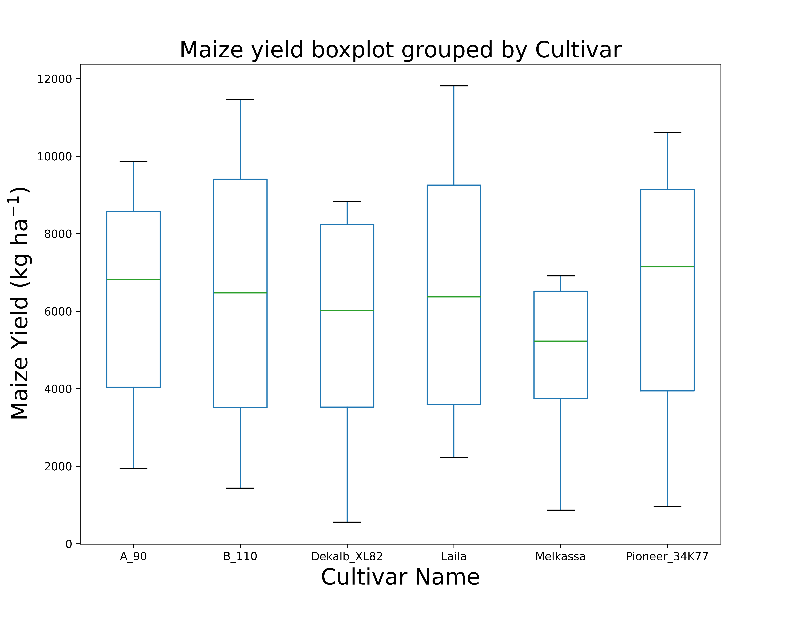

.. rubric:: Table of Contents

.. contents::
   :local:
   :depth: 2
   :class: compact

.. _comp_cultivar:
Comparing cultivars yield
===============================

In this tutorial we are going to compare the cultivar yield across different cultivars using apsimNGpy

Firstly, we are going to start by creating a none permutation experiment

.. code-block:: python

    from apsimNGpy.core.apsim import ApsimModel
    model = ApsimModel('Maize')
    model.create_experiment(permutation=False)
    model.add_factor(specification="[Sow using a variable rule].Script.CultivarName =  Dekalb_XL82, Melkassa, Pioneer_34K77, Laila, B_110, A_90")
    model.run()
    df = model.results

.. note::

   Cultivars ``Dekalb_XL82, Melkassa, Pioneer_34K77, Laila, B_110, A_90`` were selected randomly for demonstration purposes only. We also assumes that they are planted in the same field, therefore, same weather and soil factors.
   To see all the available cultivars and select from a list use::

       model.inspect_model('Cultivar', fullpath=False)

getting info about the simulated output

.. code-block:: python

    import pandas as pd
    pd.set_option('display.max_columns', None)
    df.info()

# output

.. code-block:: python

    <class 'pandas.core.frame.DataFrame'>
    RangeIndex: 60 entries, 0 to 59
    Data columns (total 18 columns):
     #   Column                            Non-Null Count  Dtype
    ---  ------                            --------------  -----
     0   SimulationName                    60 non-null     object
     1   SimulationID                      60 non-null     int64
     2   CheckpointID                      60 non-null     int64
     3   CheckpointName                    60 non-null     object
     4   Clock.Today                       60 non-null     object
     5   CultivarName                      60 non-null     object
     6   Experiment                        60 non-null     object
     7   Maize.AboveGround.N               60 non-null     float64
     8   Maize.AboveGround.Wt              60 non-null     float64
     9   Maize.Grain.N                     60 non-null     float64
     10  Maize.Grain.NumberFunction        60 non-null     float64
     11  Maize.Grain.Size                  60 non-null     float64
     12  Maize.Grain.Total.Wt              60 non-null     float64
     13  Maize.Grain.Wt                    60 non-null     float64
     14  Maize.Phenology.CurrentStageName  60 non-null     object
     15  Maize.Total.Wt                    60 non-null     float64
     16  Yield                             60 non-null     float64
     17  Zone                              60 non-null     object
    dtypes: float64(9), int64(2), object(7)
    memory usage: 8.6+ KB
    # most of the columns in the dataset are float

other alternative:

.. code-block:: python

    df.describe()

Since our major factor is CultivarName, we will next examine the corresponding mean yield for each cultivar

.. code-block:: python

    mean_yields = df.groupby('CultivarName')['Yield'].mean().sort_values(ascending=False)
    print(mean_yields)

    # output
    CultivarName
    Laila            6610.2287
    Pioneer_34K77    6608.3364
    B_110            6535.0578
    A_90             6286.9042
    Dekalb_XL82      5611.6749

    Melkassa         4831.0817
    Name: Yield, dtype: float64

Clearly Melkassa has the lowest yield, and laila performed better than all other cultivars. Let's take a step further and visualize their mean, median, minimum or maximum values using a boxplot

.. code-block:: python

    from matplotlib import pyplot as plt
    model.boxplot('Yield', by = 'CultivarName', figsize=(10,8), rotate_xticks=False, show=True)
    plt.show()

Obviously, there is no doubt `Melikassa` performs poorly in this area in terms of maize yield quarterly percentiles and median are very different fom the rest of the cultivars.
Meanwhile `Laila` and ``B_110` are similar, but different from that of `Dekalb_XL82`

.. code-block:: python

   model.series_plot(x= 'Year', y= 'Yield', hue='Cultivar')
   plt.show()

Variability across the simulation years
----------------------------------------

.. image:: ../images/Cultivar_Maize_Yield_Lineplot.png

All cultivar had the same annual yield trend but there is a year when a_90 had more maize yield than all the others

.. seealso::

   - API Reference: :class:`~apsimNGpy.core.experimentmanager.ExperimentManager`
   - :ref:`quick_factorial_experiments`
   - :ref:`More Plotting examples <Plots>`
   - :ref:`API Reference <api_ref>`
