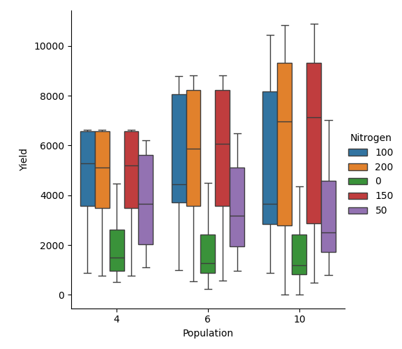

.. _quick_factorial_experiments:

Quick and Simple Way to Run Factorial Experiments
=================================================

.. rubric:: Table of Contents

.. contents::
   :local:
   :depth: 4
   :class: compact

This guide demonstrates how to set up and run factorial experiments using `apsimNGpy`.
Factorial experiments involve systematically varying multiple factors to observe their effects on outputs such as crop yield.

The :class:`~apsimNGpy.core.experiment.ExperimentManager`: in ``apsimNGpy`` provides a high-level interface to build factorial experiments
programmatically without APSIM GUI or template.

Why apsimNGpy for factorial experiments
-----------------------------------------

Data in apsimNGpy is **lazily loaded**, allowing users and researchers to run
large factorial experiments workflows without excessive memory usage.
Simulation outputs are also readily available for downstream analysis.

Quick Overview
------------------

The `create_experiment_from_models` workflow provides a streamlined way to build APSIM experiments directly from one or more ApsimModel instances. It allows you to:

Use existing ApsimModel instances as the basis for an experiment
Define and add multiple experimental factors, such as fertilizer rate or sowing density
Generate factor combinations or treatment permutations
Create and configure the corresponding APSIM experiment simulations
Export the resulting experiment to an .apsimx file
Return an ApsimModel instance that can be further inspected, edited, run, and visualized

Note: This workflow replaces the deprecated `ExperimentManager` class, which will be removed in a future release.

Step 1. Import the API and initialize it
-----------------------------------------

.. code-block:: python

   from apsimNGpy.core.experiment import create_experiment_from_models
   from apsimNGpy.core.experiment_tools import factor_spec
   experiment = create_experiment_from_models(
            model="Maize",# This loads default maize model, but you can replace it with an .apsimx file path
            specifications=factor_spec(
                "Maize",
                param_node_location="Sow using a variable rule",
                node_type="Manager",
                param_identifier="Population",
                values=[6, 10, 14],
                rename="population",
            ),
        )
   experiment.run()
   df = experiment.results

Configuring Factors
----------------------------
Multiple factors can be specified using a dictionary. Each dictionary key represents the factor name, and
the corresponding value defines the parameter-path specification. See the examples below

.. code-block:: python

    experiment = create_experiment_from_models('Maize',
                                            specifications={
                                                'ftype': "[Fertilise at sowing].Script.FertiliserType= DAP,NO3N",
                                                'Amount': "[Fertilise at sowing].Script.Amount= 0, 300",
                                            }

.. note::

   Using a dictionary is simple and convenient, but it can also make it easy to introduce invalid configurations without realizing it.
   The ``factor_spec`` method helps avoid this by allowing you to explicitly specify the model, node name or parameter path, and the corresponding values.

   Under the hood, Pydantic models together with ``ApsimModel`` are used to validate the supplied arguments and ensure that the specification is correctly structured.

As specification is a dict, we can start with an empty dict and add one factor at a time as follows

.. code-block:: python

        specifications = {}

        specifications.update(
            factor_spec(
                "Maize",
                param_node_location="Organic",
                node_type="Organic",
                param_identifier="Carbon[1]",
                values=[0.45, 1, 3],
                rename="initial_carbon",
            )
        )

        specifications.update(
            factor_spec(
                "Maize",
                param_node_location="Sow using a variable rule",
                node_type="Manager",
                param_identifier="Population",
                values=[6, 10, 14],
                rename="population",
            )
        )

Pass the specifications to :func:`~apsimNGpy.core.experiment.create_experiment_from_models`

    .. code-block:: python

        experiment = create_experiment_from_models(
            model="Maize",
            specifications=specifications,
            permutation=True,
        )

        experiment.run()
        results = experiment.results

Visualization and other analysis
---------------------------------------------
The returned ApsimModel instance provides access to all methods and attributes available on ApsimModel objects,
including tools for model visualization, inspection, editing, and simulation management.

a) Visualization
^^^^^^^^^^^^^^^^^^^^
.. code-block:: python

    exp.cat_plot(x='Population', y='Yield', hue='Nitrogen', table='Report', kind='box',)

b) Statistical analysis
^^^^^^^^^^^^^^^^^^^^^^^^^^
What is is the mean of maize grain yield if grouped by population density?

.. code-block:: python

  df  = exp.results
  df.groupby('Population')['Yield'].mean()

.. code-block:: none

    Out[6]:
    Population
    10    4489.068667
    4     4009.747575
    6     4385.225238
    Name: Yield, dtype: float64

What about by Nitrogen fertilizers?

.. code-block:: python

  df.sort_values(by='Nitrogen', inplace=True)
  df.groupby('Nitrogen')['Yield'].mean()

.. code-block:: none

    Out[17]:
    Nitrogen
    0      1759.903894
    100    5145.991310
    150    5580.979357
    200    5523.046246
    50     3463.481660
    Name: Yield, dtype: float64

From the mean values obtained in both code examples,
it is evident that nitrogen fertilizer has a greater influence
on corn grain yield than plant population density, as reflected by
the higher mean yield values, especially at high nitrogen rates.

.. Hint::

   To conduct a factorial experiment involving ``cultivar`` modifications, a crop replacement must be added.
   use ``add_crop_replacements`` method before running

.. note::

   This workflow replaces the ``ExperimentManager`` class, which is deprecated and will be removed in a future release.

Further Reading
--------------------

For advanced usage (e.g., linked script validation, mixed designs), refer to the API reference section.

.. seealso::

   - :ref:`comp_cultivar`
   - :ref:`api_ref`

