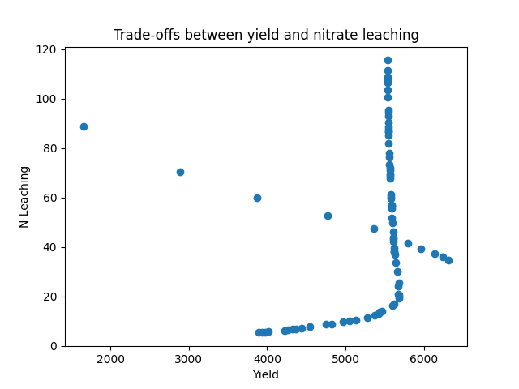

.. _moo_opt:

Multi-Objective Optimization with apsimNGpy
============================================

In real-world agricultural systems, most objectives—such as maximizing crop yield while minimizing environmental impact—are inherently conflicting. These trade-offs cannot be effectively addressed using single-objective optimization algorithms, which are limited to optimizing one goal at a time. Fortunately, multi-objective optimization algorithms inspired by evolutionary principles are well-suited to handle such complexity by exploring a range of trade-offs between competing objectives.

This tutorial demonstrates how to perform multi-objective optimization on an APSIM Next Generation model using the apsimNGpy.optimizer.moo module. You will learn two ways to define decision variables and how to apply evolutionary algorithms via the pymoo library. This approach allows you to explore and analyze trade-offs among competing objectives, such as productivity and sustainability, in a robust and flexible way.

.. admonition:: Prerequisites

    Make sure you have the following installed and configured:

    * **APSIM Next Generation installed**

    * **Python 3.10+**

    * **apsimNGpy** package (latest version)

    * Python packages: ``pymoo``, ``matplotlib``, ``numpy``, and ``pandas``

Step 1: Import required modules
^^^^^^^^^^^^^^^^^^^^^^^^^^^^^^^
.. _moo:

.. code-block:: python

    from apsimNGpy.optimizer.moo import MultiObjectiveProblem, compute_hyper_volume, NSGA2
    from pymoo.optimize import minimize
    import matplotlib.pyplot as plt
    from apsimNGpy.core.apsim import ApsimModel as Runner

.. admonition:: Interpretation

    * :class:`~apsimNGpy.core.apsim.ApsimModel` handles model simulation and editing. It is an apsimNGpy class
    * :class:`~apsimNGpy.optimizer.moo.MultiObjectiveProblem` wraps your problem into a multi-objective one
    * ``NSGA2``: a multi-objective genetic algorithm
    * :meth:`~apsimNGpy.optimizer.moo.MultiObjectiveProblem.minimize` will be used to minimize the objectives in the finals steps

Step 2: Initialize the APSIM model runner
^^^^^^^^^^^^^^^^^^^^^^^^^^^^^^^^^^^^^^^^^

You create a runner tied to a specific `.apsimx` model file. This runner manages simulation and parameter editing.
Here, I a using the default maize template. Because it does not have nitrate leaching in its Report table, I have also added it.

.. code-block:: python

    runner = Runner("Maize")
    runner.add_report_variable('[Soil].Nutrient.NO3.kgha[1] as nitrate', report_name='Report')

.. admonition:: For more ``runner`` API details, check the link below

   ApsimModel API: :class:`~apsimNGpy.core.apsim.ApsimModel`

Step 3: Define Objective Functions
^^^^^^^^^^^^^^^^^^^^^^^^^^^^^^^^^^

Objective functions take APSIM output (as a DataFrame) and return scalar values. You can define any number of such functions depending on the goals.
If you have 3 objectives, then we expect 3 functions.

.. important::

   Maximization objectives must be converted into minimization form by negating them (e.g., ``-f(x)``), since the underlying optimization algorithms are designed to minimize objective functions.

.. code-block:: python

    def maximize_yield(df):
        return -df['Yield'].mean()

    def minimize_nitrate_leaching(df):
        return df['nitrate'].sum()

Step 4a: Define decision variables (Approach 1 - direct List)
^^^^^^^^^^^^^^^^^^^^^^^^^^^^^^^^^^^^^^^^^^^^^^^^^^^^^^^^^^^^^

You can directly supply a list of variables to optimize as follows:.

.. code-block:: python

    decision_vars = [
        {'path': '.Simulations.Simulation.Field.Fertilise at sowing',
         'Amount': "?", 'bounds': [50, 300], 'v_type': 'float'},

        {'path': '.Simulations.Simulation.Field.Sow using a variable rule',
         'Population': "?", 'bounds': [4, 14], 'v_type': 'float'}
    ]
    # initialise the problem
    problem = MultiObjectiveProblem(runner, objectives=[maximize_yield, minimize_nitrate_leaching], decision_vars=decision_vars)

Each dictionary defines:

* ``path``: the APSIM model path to the component.
* ``Amount`` / `Population`: the parameter to be optimized (denoted by '?').
* ``bounds``: lower and upper bounds for the optimizer.
* ``v_type``: variable type.

.. note::

   Each decision variable specification must contain exactly one parameter marked with ``'?'``. This signifies the target parameter to be optimized during the calibration or search process.

Step 3b: Define decision variables (Approach 2 - using ``add_control()``)
^^^^^^^^^^^^^^^^^^^^^^^^^^^^^^^^^^^^^^^^^^^^^^^^^^^^^^^^^^^^^^^^^^^^^^^^^^^^^^

Instead of a list, you can add each parameter one at a time.
There is a need to initiate our problem with objectives only, then add control variables on the fly.

.. code-block:: python

    # initialise the problem
    problem = MultiObjectiveProblem(runner, objectives=[maximize_yield, minimize_nitrate_leaching])

    problem.add_parameters(
        path='.Simulations.Simulation.Field.Fertilise at sowing',
        Amount='?', bounds=[50, 300], v_type='float')

    problem.add_parameters(
        path='.Simulations.Simulation.Field.Sow using a variable rule',
        Population='?', bounds=[4, 14], v_type='float')

.. Note::

    The best approach depends on the user's preference, but the last approach helps the user to focus on one control variables required details at a time.

Step 5: Run the NSGA-II optimizer
^^^^^^^^^^^^^^^^^^^^^^^^^^^^^^^^^^^^^

``NSGA-II`` is a commonly used algorithm for multi-objective problems. There are other genetic multi-objective algorithms, but for trade-off analysis with APSIM,
``NSGA-II`` is more than adequate. You can now run  it as follows:

.. code-block:: python

    algorithm = NSGA2(pop_size=20)

    result = minimize(
        problem.get_problem(),
        algorithm,
        ('n_gen', 10),
        seed=1,
        verbose=True
    )

* ``pop_size``: number of candidate solutions per generation.
* ``n_gen``: number of generations to run.

Step 6: Plot the Pareto Front
^^^^^^^^^^^^^^^^^^^^^^^^^^^^^^^^

The results show trade-offs between competing objectives. You can visualize them:

.. code-block:: python

    F = result.F
    plt.scatter(F[:, 0]* -1, F[:, 1])
    plt.xlabel("Yield")
    plt.ylabel("N Leaching")
    plt.title("Pareto Front")
    plt.show()

.. image:: ../images/yield_nleach.png

.. admonition:: comment

  From the graph above, it is clear that achieving high corn yield while simultaneously reducing nitrate leaching is quite challenging.
  This is because high yields typically require the application of large amounts of nitrogen fertilizer, which is often associated with increased nitrate leaching.

.. tip::

   Compute Hyper volume (Optional)

   The hyper volume gives a scalar metric of solution quality, and can be useful if you want to explore the best inputs such as pop_size, max_gen.

    A high value indicates better solution quality than a lower one. Therefore, it can also be used to compare the performance of multiple minimization algorithms.

.. code-block:: python

    hv = compute_hyper_volume(F, normalize=True)
    print("Hyper volume:", hv)

.. hint::

   Objectives are typically expressed in different units, and some—such as yield—may have much larger amplitudes.
   This makes determining a suitable reference point challenging. In such cases, normalization can help automatically detect the reference point by applying specific thresholds.

.. attention::

    While multi-objective algorithms like NSGA-II can technically handle single-objective problems,
    doing so is like using an axe to slice an orange or shooting a mosquito with an m16 —it's overkill. Simpler and more efficient algorithms are better suited for single-objective optimization tasks.

Comparing objectives without mult-objective optimization
^^^^^^^^^^^^^^^^^^^^^^^^^^^^^^^^^^^^^^^^^^^^^

What if we just run out the different combinations of the decision variables: population density and the nitrogen application rate can
we ge the same pareto front and trade-offs we have seen in that graph? To answer this question we are going to run a factorial experiment.

.. code-block:: python

    import numpy as np
    population  = [str(i) for i in np.random.randint(low=1, high=12, size=20)]
    nitrogen  = [str(i) for i in np.random.randint(low=50, high=300, size=20)]
    runner.create_experiment(permutation=False, base_name='Simulation')
    runner.add_factor(specification=f"[Fertilise at sowing].Script.Amount = {','.join(nitrogen)}", factor_name='Nitrogen')
    runner.add_factor(specification=f"[Sow using a variable rule].Script.Population ={','.join(population)}",
                     factor_name='Population')
    runner.run(verbose=True)

    df = runner.results.drop_duplicates()
    df  = df.groupby('SimulationID')[['Yield', 'nitrate']].mean()
    yi = df.Yield
    nitrate  =df.nitrate
    plt.scatter(yi , nitrate)
    plt.xlabel("Yield")
    plt.ylabel("N Leaching")
    plt.title("Trade-offs between yield and nitrate leaching")
    plt.show()

.. admonition:: comment

  From the graph above, it is clear that the pattern is no where close to what we could call a clear pareto front that can demonstrate the trade-offs between different objectives.

.. seealso::

   - :ref:`api_ref`
   - :ref:`single_opt`
