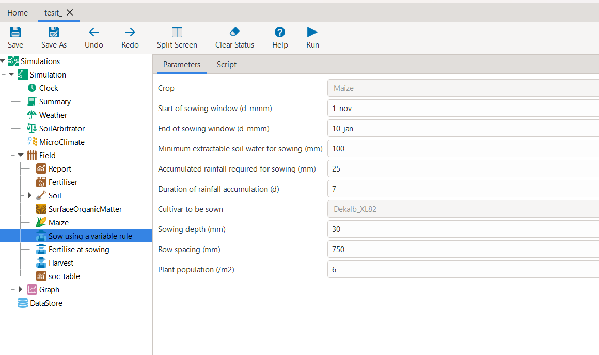
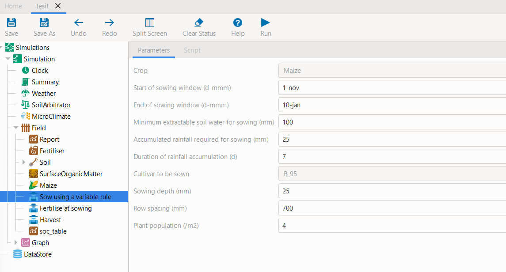

.. meta::
    :description lang=en:
          Previewing a file in GUI can be accomplished by the preview_simulation method,
          Allowing user to inspect the simulation template or change parameters if watch=True

Model Preview in GUI
=====================

.. rubric:: Table of Contents

.. contents::
   :local:
   :depth: 2
   :class: compact

The :meth:`~apsimNGpy.core.apsim.ApsimModel.preview_simulation` method provides the
primary mechanism for opening the current in-memory APSIM model in the APSIM Next
Generation GUI. When invoked, the method first serializes the active simulation to
the specified out_path, then launches the APSIM NG GUI using the current APSIM binary resolved
through :func:~`apsimNGpy.core.config.get_apsim_bin_path`. This allows users to inspect the model tree,
verify component structures, and perform quick manual edits alongside their
Python workflow. Importantly, the model is opened using the exact APSIM NG version
configured for the current apsimNGpy session, ensuring version consistency between the GUI and the Python environment.

The :meth:`~apsimNGpy.core.apsim.ApsimModel.preview_simulation` takes in one parameter
`watch : bool`, which defaults to False. If True, Python will listen for GUI edits and sync them back into the model instance in (near) real time.

.. tip::

  The file opened in the GUI is a *saved copy* of this Python object.
  Changes made in the GUI are **not** propagated back to the
  :class:`~apsimNGpy.core.apsim.ApsimModel` instance unless you set
  ``watch=True``.
  Otherwise, to continue working in Python with GUI edits, save the file in APSIM
  and re-load it, for example:

  .. code-block:: python

     ApsimModel("gui_edited_file_path.apsimx")

Examples
---------
**1. Preview only**

.. code-block:: python

   from apsimNGpy.core.apsim import ApsimModel
   model = ApsimModel("Maize", out_path="test_.apsimx")
   model.preview_simulation()

**2. Preview and edit simultaneously**

After opening the APSIMX file in the GUI via the watching mode (``watch=True``), you can modify any parameters using GUI interface. The Example given below involved changing parameters such as
**Plant population (/m²)**, **Cultivar to be sown**, and **Row spacing (mm)**
in the *Sow using a variable rule* script and finally, checked whether the changes were successful by inspecting the model.

.. code-block:: python

   model.preview_simulation(watch=True)

**Example console output when** ``watch=True``:

.. code-block:: none

   2025-10-24 13:05:08,480 - INFO - Watching for GUI edits...
   Save in APSIM to sync back.
   2025-10-24 13:05:08,490 - INFO - Press Ctrl+C in this cell to stop.
   APSIM GUI saved. Syncing model...
   2025-10-24 13:05:24,112 - INFO - Watching terminated successfully.

.. note::

   When ``watch=True``, follow the console instructions.
   One critical step is that you **must press** ``Ctrl+C`` to stop watching.

**Checking if changes were successfully propagated back**

.. code-block:: python

   model.inspect_model_parameters("Models.Manager", "Sow using a variable rule")

.. code-block:: none

   {'Crop': '[Maize]',
    'StartDate': '1-nov',
    'EndDate': '10-jan',
    'MinESW': '100',
    'MinRain': '25',
    'RainDays': '7',
    'CultivarName': 'B_95',
    'SowingDepth': '25',
    'RowSpacing': '700',
    'Population': '4'}

.. tip::

   Depending on your environment, you may need to close the GUI window to continue
   or follow the prompts shown after termination.

.. admonition:: Final note on Model inspections

    The inspection methods demonstrated in these tutorials are intended to support users during the initial
    setup phase—particularly when creating or validating a base APSIM file before running experiments or simulations.
    These tools help users understand the model structure, verify parameter values, and confirm that intended edits are correctly specified. They are not meant to be used inside repeated or large-scale simulation loops; rather,
    they serve as a prerequisite step for ensuring confidence in model configuration prior to automated workflows.